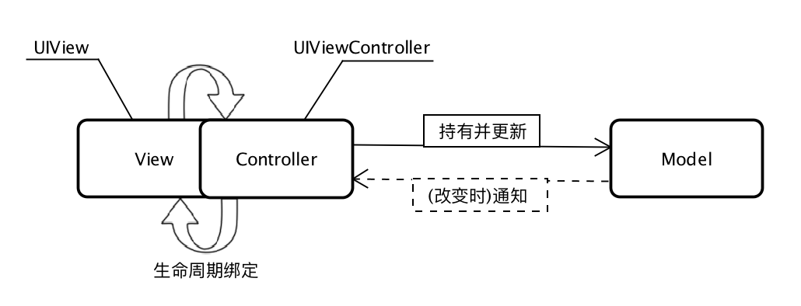
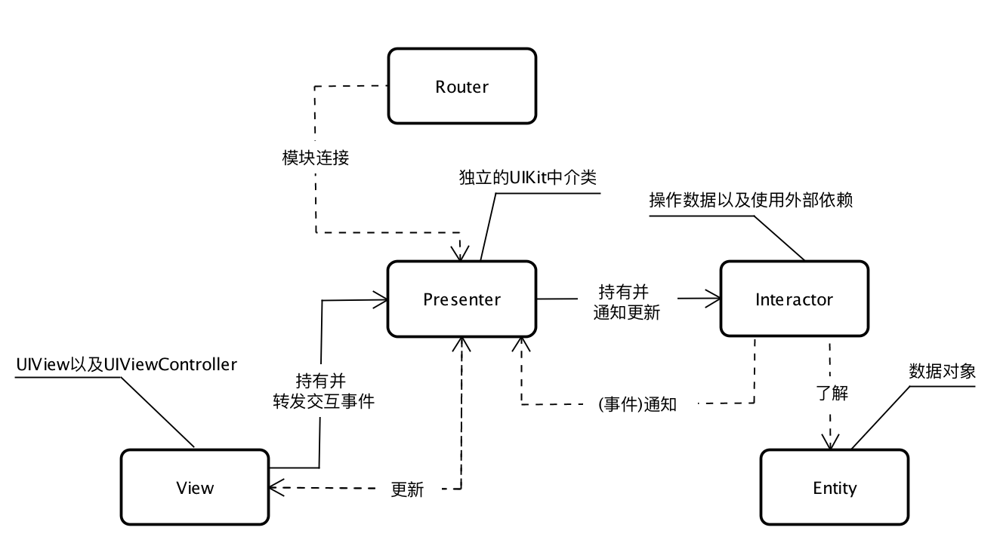

> 译自：[iOS Architecture Patterns](https://medium.com/ios-os-x-development/ios-architecture-patterns-ecba4c38de52)(模式图也已汉化)。在[这里](http://slides.com/borlov/arch/fullscreen#/)可以看到一个幻灯片

在 iOS 中使用 MVC 架构感觉很奇怪？ 迁移到MVVM架构又怀有疑虑？听说过 VIPER 又不确定是否真的值得切换？

相信你会找到以上问题的答案，如果没找到请在评论中指出。

你将要整理出你在 iOS 环境下所有关于架构模式的知识。我们将带领大家简要的回顾一些流行的架构，并且在理论和实践上对它们进行比较，通过一些小的例子深化你的认知。如果对文中提到的一些关键词有兴趣，可以点击连接去查看更详细的内容。

掌控设计模式可能会使人上瘾，所以要当心，你可能会对一些问题清晰明了，不再像阅读之前那样迷惑，比如下面这些问题：

- 谁应该来负责网络请求？Model 还是 Controller ？
- 应该怎样向一个新的页面的 ViewModel 传入一个 Model ?
- 谁来创建一个 VIPER 模块，是 Router 还是 Presenter ?


## 一、为什么要关注架构设计？

因为假如你不关心架构，那么总有一天，需要在同一个庞大的类中调试若干复杂的事情，你会发现在这样的条件下，根本不可能在这个类中快速的找到以及有效的修改任何bug.当然，把这样的一个类想象为一个整体是困难的，因此，有可能一些重要的细节总会在这个过程中会被忽略。如果现在的你正是处于这样一个开发环境中，很有可能具体的情况就像下面这样：

- 这个类是一个UIViewController的子类
- 数据直接在UIViewController中存储
- UIView类几乎不做任何事情
- Model 仅仅是一个数据结构
- 单元测试覆盖不了任何用例

即使是你遵循了Apple的指导原则并且实现了其 [MVC](https://developer.apple.com/library/ios/documentation/General/Conceptual/DevPedia-CocoaCore/MVC.html) 模式，以上这些情况仍旧会出现。不必惊慌，Apple所提出的 [MVC](https://developer.apple.com/library/ios/documentation/General/Conceptual/DevPedia-CocoaCore/MVC.html) 模式存在一些问题，我们之后会详述。

在此，我们可以定义一个好的架构应该具备的特点：

1. 任务均衡分摊给具有清晰角色的实体
2. 可测试性通常都来自与上一条（对于一个合适的架构是非常容易）
3. 易用性和低成本维护

### 1.1 为什么采用分布式?

采用分布式可以在我们要弄清楚一些事情的原理时保持一个均衡的负载。如果你认为你的开发工作越多，你的大脑越能习惯复杂的思维，其实这是对的。但是，不能忽略的一个事实是，这种思维能力并不是线性增长的，而且也并不能很快的到达峰值。所以，能够战胜这种复杂性的最简单的方法就是在遵循 [单一功能原则](https://en.wikipedia.org/wiki/Single_responsibility_principle) 的前提下，将功能划分给不同的实体。

### 1.2 为什么需要易测性？

其实这条要求对于哪些习惯了单元测试的人并不是一个问题，因为在添加了新的特性或者要增加一些类的复杂性之后通常会失效。这就意味着，测试可以避免开发者在运行时才发现问题----当应用到达用户的设备，每一次维护都需要浪费长达至少[一周](http://appreviewtimes.com)的时间才能再次分发给用户。

### 1.3 为什么需要易用性？

这个问题没有固定的答案，但值得一提的是，最好的代码是那些从未写过的代码。因此，代码写的越少，Bug就越少。这意味着希望写更少的代码不应该被单纯的解释为开发者的懒惰，而且也不应该因为偏爱更聪明的解决方案而忽视了它的维护开销。

## 二、MV(X)系列概要

当今我们已经有很架构设计模式方面的选择:

- [MVC](https://en.wikipedia.org/wiki/Model–view–controller)
- [MVP](https://en.wikipedia.org/wiki/Model–view–presenter)
- [MVVM](https://en.wikipedia.org/wiki/Model_View_ViewModel)
- [VIPER](https://www.objc.io/issues/13-architecture/viper/)

前三种设计模式都把一个应用中的实体分为以下三类：

- **Models** — 负责主要的数据或者操作数据的[数据访问层](https://en.wikipedia.org/wiki/Data_access_layer)，可以想象 Perspn 和 PersonDataProvider 类。
- **Views** — 负责展示层（GUI），对于iOS环境可以联想一下以 UI 开头的所有类。
- **Controller/Presenter/ViewModel** — 负责协调 Model 和 View，通常根据用户在View上的动作在Model上作出对应的更改，并根据 Model 的更改更新 View。

将实体进行划分给我们带来了以下好处：

- 更好的理解它们之间的关系
- 复用（尤其是对于View和Model）
- 独立的测试

让我们开始了解MV(X)系列，之后再返回到VIPER模式。

## 三、MVC的过去

在我们探讨Apple的MVC模式之前，我们来看下[传统的MVC模式](https://en.wikipedia.org/wiki/Model–view–controller)。


在这种情况下，View是无状态的。一旦Model被改变，Controller就会简单地渲染View。就像网页一样，在点击了跳转到某个其他页面的连接之后就会完全的重新加载页面。

虽然可以在 iOS 应用程序中实现传统的 MVC，但由于架构问题，它没有多大意义 —— 三个实体是紧密耦合的，实体间相互都有通信。这很显然会大大降低了三者的复用性，而这正是我们不愿意看到的。鉴于此我们不再给出例子。

> 传统的MVC架构不适用于当下的iOS开发

## 四、苹果的MVC

### 4.1 愿景

Cocoa MVC：


由于Controller是一个介于View 和 Model之间的协调器，所以View和Model之间没有任何直接的联系。Controller是一个最小可重用单元，这对我们来说是一个好消息，因为我们总要找一个地方来写逻辑复杂度较高的代码，而这些代码又不适合放在Model中。

理论上来讲，这种模式看起来非常直观，但你有没有感到哪里有一丝诡异？你甚至听说过，有人将MVC的缩写展开成（Massive View Controller），更有甚者，[为View controller减负](https://www.objc.io/issues/1-view-controllers/lighter-view-controllers/)也成为iOS开发者面临的一个重要话题。如果苹果继承并且对MVC模式有一些进展，所有这些为什么还会发生？

### 4.2 现实

Realistic Cocoa MVC：



Cocoa的MVC模式驱使人们写出臃肿的视图控制器，因为它们与View的生命周期息息相关，因此很难说View和ViewController是分离的。

尽管仍可以将业务逻辑和数据转换到Model，但是大多数情况下当需要为View减负的时候我们却无能为力了，很多时候，View的最大的任务就是向Controller传递用户动作事件。

ViewController最终会承担一切代理和数据源的职责，还负责一些分发和取消网络请求以及一些其他的任务，因此它的名字的由来...你懂的。

你可能会看见过很多次这样的代码：

```objectivec
var userCell = tableView.dequeueReusableCellWithIdentifier("identifier") as UserCell
userCell.configureWithUser(user)
```

这个cell，就是个直接使用 Model 来配置的 View，此时其实已经违背了MVC的原则，但是这种情况是一直发生的，甚至于人们不觉得这里有哪些不对。如果严格遵守MVC的话，你会把对cell的设置放在 Controller 中，而不是向这个View传递一个Model对象，但这样就会大大增加Controller的体积。

> Cocoa 的MVC被写成Massive View Controller 是不无道理的。

直到进行[单元测试](http://nshipster.com/unit-testing/)的时候才会发现问题越来越明显。因为你的ViewController和View是紧密耦合的，对它们进行测试就显得很艰难，你得有足够的创造性来模拟View和它们的生命周期，在以这样的方式来写View Controller的同时，业务逻辑的代码也逐渐被分散到View的布局代码中去。

我们看下一些简单的例子:

```objectivec
import UIKit

struct Person { // Model
    let firstName: String
    let lastName: String
}

class GreetingViewController : UIViewController { // View + Controller
    var person: Person!
    let showGreetingButton = UIButton()
    let greetingLabel = UILabel()
    
    override func viewDidLoad() {
        super.viewDidLoad()
        self.showGreetingButton.addTarget(self, action: "didTapButton:", forControlEvents: .TouchUpInside)
    }
    
    func didTapButton(button: UIButton) {
        let greeting = "Hello" + " " + self.person.firstName + " " + self.person.lastName
        self.greetingLabel.text = greeting
        
    }
    // layout code goes here
}
// Assembling of MVC
let model = Person(firstName: "David", lastName: "Blaine")
let view = GreetingViewController()
view.person = model;
```

> MVC可以在一个正在显示的ViewController中实现

这段代码看起来可测试性并不强，我们可以把和greeting相关的都放到GreetingModel中然后分开测试，但是这样我们就无法通过直接调用在GreetingViewController中的UIView相关的方法（viewDidLoad和didTapButton方法）来测试页面的展示逻辑了，因为一旦调用则会使整个页面都变化，这对单元测试来讲并不是什么好消息。

事实上，在单独一个模拟器中（比如iPhone 4S）加载并测试UIView并不能保证在其他设备中也能正常工作（例如iPad），因此我建议在单元测试的Target的设置下移除"Host Application"项，并且不要在模拟器中测试你的应用。

> View和Controller之间的交互 [并不适合使用单元测试](http://ashfurrow.com/blog/whats-worth-unit-testing-in-objective-c/) 来测试。

以上所述，似乎Cocoa MVC 看起来是一个相当差的架构方案。我们来重新评估一下文章开头我们提出的MVC一系列的特征:

- **任务均摊** —— View和Model确实是分开的，但是View和Controller却是紧密耦合的
- **可测试性** —— 由于糟糕的分散性，只能对Model进行测试
- **易用性** —— 与其他几种模式相比最小的代码量。熟悉的人很多，因而即使对于经验不那么丰富的开发者来讲维护起来也较为容易。

如果你不想在架构选择上投入更多精力，那么Cocoa MVC无疑是最好的方案，而且你会发现一些其他维护成本较高的模式对于你所开发的小的应用是一个致命的打击。

> 就开发速度而言，Cocoa MVC是最好的架构选择方案。

## 五、MVP(Passive View)

### 5.1 MVP 实现了Cocoa的MVC的愿景

Passive View variant of MVP：


这看起来不正是苹果所提出的MVC方案吗？确实是的，这种模式的名字是[MVP](https://en.wikipedia.org/wiki/Model–view–presenter)（Passive View variant，被动视图变体），但是，这就是说苹果的MVC实际上就是[MVP](https://en.wikipedia.org/wiki/Model–view–presenter)了？不，并不是这样的。如果你仔细回忆一下，View是和Controller紧密耦合的，但是MVP的协调器Presenter并没有对ViewController的生命周期做任何改变，因此View可以很容易的被模拟出来。在Presenter中根本没有和布局有关的代码，但是它却负责更新View的数据和状态。

> 假如告诉你UIViewController就是View呢？

就MVP而言，UIViewController的子类实际上就是Views并不是Presenters。这点区别使得这种模式的可测试性得到了极大的提高，付出的代价是开发速度的一些降低，因为必须要做一些手动的数据和事件绑定，从下例中可以看出：

```objectivec
import UIKit

struct Person { // Model
    let firstName: String
    let lastName: String
}

protocol GreetingView: class {
    func setGreeting(greeting: String)
}

protocol GreetingViewPresenter {
    init(view: GreetingView, person: Person)
    func showGreeting()
}

class GreetingPresenter : GreetingViewPresenter {
    unowned let view: GreetingView
    let person: Person
    required init(view: GreetingView, person: Person) {
        self.view = view
        self.person = person
    }
    func showGreeting() {
        let greeting = "Hello" + " " + self.person.firstName + " " + self.person.lastName
        self.view.setGreeting(greeting)
    }
}

class GreetingViewController : UIViewController, GreetingView {
    var presenter: GreetingViewPresenter!
    let showGreetingButton = UIButton()
    let greetingLabel = UILabel()
    
    override func viewDidLoad() {
        super.viewDidLoad()
        self.showGreetingButton.addTarget(self, action: "didTapButton:", forControlEvents: .TouchUpInside)
    }
    
    func didTapButton(button: UIButton) {
        self.presenter.showGreeting()
    }
    
    func setGreeting(greeting: String) {
        self.greetingLabel.text = greeting
    }
    
    // layout code goes here
}
// Assembling of MVP
let model = Person(firstName: "David", lastName: "Blaine")
let view = GreetingViewController()
let presenter = GreetingPresenter(view: view, person: model)
view.presenter = presenter
```

### 5.2 关于整合问题的重要说明

MVP是第一个如何协调整合三个实际上分离的层次的架构模式，既然我们不希望View和Model耦合，那么在显示的View Controller（其实就是View）中处理这种协调的逻辑就是不正确的，因此我们需要在其他地方来做这些事情。例如，我们可以做基于整个App范围内的路由服务，由它来负责执行协调任务，以及View到View的展示。这个出现并且必须处理的问题不仅仅是在MVP模式中，同时也存在于以下几种方案中。

我们来看下MVP模式下的三个特性的分析：

- 任务均摊 —— 我们将最主要的任务划分到Presenter和Model，而View的功能较少（虽然上述例子中Model的任务也并不多）。
- 可测试性 —— 非常好，由于一个功能简单的View层，所以测试大多数业务逻辑也变得简单
- 易用性 —— 在我们上边不切实际的简单的例子中，代码量是MVC模式的2倍，但同时MVP的概念却非常清晰

> iOS 中的MVP意味着可测试性强、代码量大。

### 5.3 变体 — MVP(Supervising Controller)

还有一些其他形态的MVP —— Supervising Controller MVP（监听Controller的MVP）。

> 核心是：Bindings(绑定)和Hooters(此处译作信号)

这个变体包含了View和Model之间的直接绑定，但是Presenter(Supervising Controller)仍然来管理来自View的动作事件，同时也能胜任对View的更新。

Supervising Controller variant of the MVP：


但是我们之前就了解到，模糊的职责划分是非常糟糕的，更何况将View和Model紧密的联系起来。这和Cocoa的桌面开发的原理有些相似。

和传统的MVC一样，写这样的例子没有什么价值，故不再给出。

## 六、MVVM

> 最新且是最伟大的MV(X)系列的一员

### 6.1 概述

[MVVM](https://en.wikipedia.org/wiki/Model_View_ViewModel)架构是MV(X)系列最新的一员，因此让我们希望它已经考虑到MV(X)系列中之前已经出现的问题。

从理论层面来讲MVVM看起来不错，我们已经非常熟悉View和Model，以及Meditor，在MVVM中它是View Model。


它和MVP模式看起来非常像:

- MVVM将ViewController视作View
- 在View和Model之间没有紧密的联系

此外，它还有像监管(Supervising)版本的MVP那样的绑定功能，但这个绑定不是在View和Model之间，而是在View和ViewModel之间。

那么问题来了，在iOS中ViewModel实际上代表什么？它基本上就是UIKit下的每个控件以及控件的状态。ViewModel调用会改变Model同时会将Model的改变更新到自身，并且因为我们绑定了View和ViewModel，第一步就是相应的更新状态。

### 6.2 绑定

我在MVP部分已经提到这点了，但是该部分我们仍会继续讨论。

如果我们自己不想自己实现，那么我们有两种选择:

- 基于KVO的绑定库如 [RZDataBinding](https://github.com/Raizlabs/RZDataBinding) 和 [SwiftBond](https://github.com/SwiftBond/Bond)
- 完全的[函数响应式编程](https://gist.github.com/JaviLorbada/4a7bd6129275ebefd5a6)，比如像[ReactiveCocoa](https://github.com/ReactiveCocoa/ReactiveCocoa)、[RxSwift](https://github.com/ReactiveX/RxSwift/)或者 [PromiseKit](https://github.com/mxcl/PromiseKit)

事实上，尤其是最近，你听到MVVM就会想到ReactiveCoca，反之亦然。尽管通过简单的绑定来使用MVVM是可实现的，但是ReactiveCocoa却能更好的发挥MVVM的特点。

但是关于这个框架有一个不得不说的事实：强大的能力来自于巨大的责任。当你开始使用Reactive的时候有很大的可能就会把事情搞砸。换句话来说就是，如果发现了一些错误，调试出这个bug可能会花费大量的时间，看下 Reactive Debugging 函数调用栈：


在我们简单的例子中，FRF框架和KVO被过渡禁用，取而代之地我们直接去调用showGreeting方法更新ViewModel，以及通过greetingDidChange 回调函数使用属性。

```objectivec
import UIKit

struct Person { // Model
    let firstName: String
    let lastName: String
}

protocol GreetingViewModelProtocol: class {
    var greeting: String? { get }
    var greetingDidChange: ((GreetingViewModelProtocol) -> ())? { get set } // function to call when greeting did change
    init(person: Person)
    func showGreeting()
}

class GreetingViewModel : GreetingViewModelProtocol {
    let person: Person
    var greeting: String? {
        didSet {
            self.greetingDidChange?(self)
        }
    }
    var greetingDidChange: ((GreetingViewModelProtocol) -> ())?
    required init(person: Person) {
        self.person = person
    }
    func showGreeting() {
        self.greeting = "Hello" + " " + self.person.firstName + " " + self.person.lastName
    }
}

class GreetingViewController : UIViewController {
    var viewModel: GreetingViewModelProtocol! {
        didSet {
            self.viewModel.greetingDidChange = { [unowned self] viewModel in
                self.greetingLabel.text = viewModel.greeting
            }
        }
    }
    let showGreetingButton = UIButton()
    let greetingLabel = UILabel()
    
    override func viewDidLoad() {
        super.viewDidLoad()
        self.showGreetingButton.addTarget(self.viewModel, action: "showGreeting", forControlEvents: .TouchUpInside)
    }
    // layout code goes here
}
// Assembling of MVVM
let model = Person(firstName: "David", lastName: "Blaine")
let viewModel = GreetingViewModel(person: model)
let view = GreetingViewController()
view.viewModel = viewModel
```

让我们再来看看关于三个特性的评估：

- 任务均摊 —— 在例子中并不是很清晰，但是事实上，MVVM的View要比MVP中的View承担的责任多。因为前者通过ViewModel的设置绑定来更新状态，而后者只监听Presenter的事件但并不会对自己有什么更新。
- 可测试性 —— ViewModel不知道关于View的任何事情，这允许我们可以轻易的测试ViewModel。同时View也可以被测试，但是由于属于UIKit的范畴，对他们的测试通常会被忽略。
- 易用性 —— 在我们例子中的代码量和MVP的差不多，但是在实际开发中，我们必须把View中的事件指向Presenter并且手动的来更新View，如果使用绑定的话，MVVM代码量将会小的多。

> MVVM很诱人，因为它集合了上述方法的优点，并且由于在View层的绑定，它并不需要其他附加的代码来更新View，尽管这样，可测试性依然很强。

## 七、VIPER

### 7.1 概述

> VIPER —— 把LEGO建筑经验迁移到iOS app的设计

[VIPER](https://www.objc.io/issues/13-architecture/viper/)是我们最后要介绍的，由于不是来自于MV(X)系列，它具备一定的趣味性。

迄今为止，划分责任的粒度是很好的选择。VIPER在责任划分层面进行了迭代，VIPER分为五个层次:



VIPER

- **交互器** —— 包括关于数据和网络请求的业务逻辑，例如创建一个实体（数据），或者从服务器中获取一些数据。为了实现这些功能，需要使用服务、管理器，但是他们并不被认为是VIPER架构内的模块，而是外部依赖。
- **展示器** —— 包含UI层面的业务逻辑以及在交互器层面的方法调用。
- **实体** —— 普通的数据对象，不属于数据访问层次，因为数据访问属于交互器的职责。
- **路由器** —— 用来连接VIPER的各个模块。

基本上，VIPER模块可以是一个屏幕或者用户使用应用的整个过程 —— 例如认证过程，可以由一屏完成或者需要几步才能完成，你的模块期望是多大的，这取决于你。

当我们把VIPER和MV(X)系列作比较时，我们会在任务均摊性方面发现一些不同:

- **Model**（数据交互）逻辑以实体（Entities）为单位（作为最小的数据结构）拆分到交互器（Interactor）中。
- **Controller/Presenter/ViewModel**的UI展示方面的职责移到了Presenter中，但是并没有数据转换相关的操作。
- **VIPER**是第一个通过路由器（Router）实现明确的地址导航模式。

> 找到一个适合的方法来实现路由对于iOS应用是一个挑战，MV(X)系列避开了这个问题。

例子中并不包含路由和模块之间的交互，所以和MV(X)系列部分架构一样不再给出例子。

```objectivec
import UIKit

struct Person { // Entity (usually more complex e.g. NSManagedObject)
    let firstName: String
    let lastName: String
}

struct GreetingData { // Transport data structure (not Entity)
    let greeting: String
    let subject: String
}

protocol GreetingProvider {
    func provideGreetingData()
}

protocol GreetingOutput: class {
    func receiveGreetingData(greetingData: GreetingData)
}

class GreetingInteractor : GreetingProvider {
    weak var output: GreetingOutput!
    
    func provideGreetingData() {
        let person = Person(firstName: "David", lastName: "Blaine") // usually comes from data access layer
        let subject = person.firstName + " " + person.lastName
        let greeting = GreetingData(greeting: "Hello", subject: subject)
        self.output.receiveGreetingData(greeting)
    }
}

protocol GreetingViewEventHandler {
    func didTapShowGreetingButton()
}

protocol GreetingView: class {
    func setGreeting(greeting: String)
}

class GreetingPresenter : GreetingOutput, GreetingViewEventHandler {
    weak var view: GreetingView!
    var greetingProvider: GreetingProvider!
    
    func didTapShowGreetingButton() {
        self.greetingProvider.provideGreetingData()
    }
    
    func receiveGreetingData(greetingData: GreetingData) {
        let greeting = greetingData.greeting + " " + greetingData.subject
        self.view.setGreeting(greeting)
    }
}

class GreetingViewController : UIViewController, GreetingView {
    var eventHandler: GreetingViewEventHandler!
    let showGreetingButton = UIButton()
    let greetingLabel = UILabel()
    override func viewDidLoad() {
        super.viewDidLoad()
        self.showGreetingButton.addTarget(self, action: "didTapButton:", forControlEvents: .TouchUpInside)
    }
    
    func didTapButton(button: UIButton) {
        self.eventHandler.didTapShowGreetingButton()
    }
    
    func setGreeting(greeting: String) {
        self.greetingLabel.text = greeting
    }
    
    // layout code goes here
}
// Assembling of VIPER module, without Router
let view = GreetingViewController()
let presenter = GreetingPresenter()
let interactor = GreetingInteractor()
view.eventHandler = presenter
presenter.view = view
presenter.greetingProvider = interactor
interactor.output = presenter
```

让我们再来评估一下特性:

- 任务均摊 —— 毫无疑问，VIPER是任务划分中的佼佼者。
- 可测试性 —— 不出意外地，更好的分布性就有更好的可测试性。
- 易用性 —— 最后你可能已经猜到了维护成本方面的问题。你必须为很小功能的类写出大量的接口。

### 7.2 什么是LEGO

当使用VIPER时，你的感觉就像是用乐高积木来搭建一个城堡，这也是一个表明当前存在一些问题的信号。可能现在就应用VIPER架构还为时过早，考虑一些更为简单的模式可能会更好。一些人会忽略这些[问题](https://inessential.com/2014/03/16/smaller_please)，大材小用。假定他们笃信VIPER架构会在未来给他们的应用带来一些好处，虽然现在维护起来确实是有些不合理。如果你也持这样的观点，我为你推荐 [Generamba](https://github.com/rambler-ios/Generamba) 这个用来搭建VIPER架构的工具。虽然我个人感觉，使用起来就像加农炮的自动瞄准系统，而不是简单的像投石器那样的简单的抛掷。

## 八、总结

我们了解了集中架构模式，希望你已经找到了到底是什么在困扰你。毫无疑问通过阅读本篇文章，你已经了解到其实并没有完全的银弹。所以选择架构是一个根据实际情况具体分析利弊的过程。

因此，在同一个应用中包含着多种架构。比如，你开始的时候使用MVC，然后突然意识到一个页面在MVC模式下的变得越来越难以维护，然后就切换到MVVM架构，但是仅仅针对这一个页面。并没有必要对哪些MVC模式下运转良好的页面进行重构，因为二者是可以并存的。