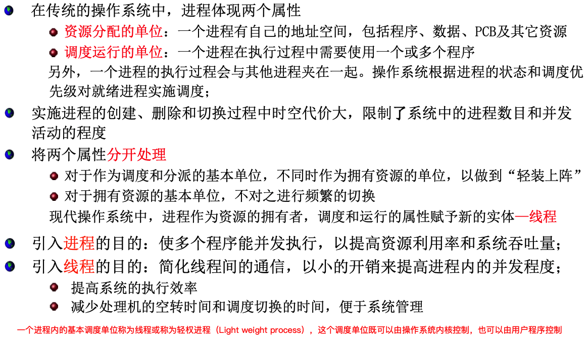

# 一、算法与数据结构

>  TLE	Time Limit Exceed(超时)

- 链表中是否有环
- 一个整型数组，将所有元素拼接成一个最大数输出
- 大型数组里面装了几万个数，找到前5个，不能用for循环。TopK问题，建小/大顶堆
- 贪心
- LRU
- N万个点勾勒一个国家的范围，然后染色
- 剑指offer 42：连续子数组的最大和
- hash表
- 用底层设计一个缓存，上限是40mb
- 二叉树按层次遍历
- 数组链表的使用场景
- 数组底层内存如何优化
- 10进制转16进制 算法
- 寻找两个正序数组的中位数
- 接雨水

# 二、OC语言

## 2.1 TaggedPointer

```objectivec
@property (nonatomic, strong) NSString *strongString;
@property (nonatomic, weak)   NSString *weakString;

_strongString =  [NSString stringWithFormat:@"%@",@"string1"];
_weakString =  _strongString;

_strongString = nil;

NSLog(@"%@", _weakString);
```


## 2.2 KVO

- 为什么KVO不释放 会闪退
- 推荐了一个facebook的安全使用kvo

## 2.3 KVC 


## 2.4 Block

### 2.4.1 Block1：讲讲Block的底层实现

- Block底层也是struct封装的，本质是个对象，拥有ISA指针
- Block中的代码以函数的形式存在于代码段，Block对应的struct有一个指针类型成员，记录了函数地址
- Block会对代码中使用到的局部变量进行捕获
  - auto变量：值捕获
  - static变量：地址捕获
  - 全局变量：不捕获，直接访问

### 2.4.2 __block的底层原理

- 编译器会将 __block变量包装成一个对象
- 再次使用的时候是实现的底层形成的 __Block_byref_xx_y类型的结构体中的成员变量

### 2.4.3 __block会造成循环引用吗


### 2.4.4 例题

1. 如果调用一个赋值为空的 block，会发生什么情况？闪退的那个地址值（address）是多少？为什么？

   0x10. 参考Block的结构

```objectivec
 struct __block_impl {
   void *isa;
   int Flags;
   int Reserved;
   void *FuncPtr;  //地址值0x10
 }
```

2. 如下

```objectivec
typedef int (^test)(int);

@interface ViewController ()

@property (nonatomic, assign) test block;
@property (nonatomic, assign) int b;

@end

@implementation ViewController

- (void)viewDidLoad {
    [super viewDidLoad];

    _b = 1;
    int a = 100;
    _block = ^(int value){
        return a+value+_b;  // 问题2：block会捕获哪些变量？捕获了a、self
    };
    NSLog(@"%@",[_block class]);
    
    if (a>10) {
        a = 10;
    }else {
        a = 20;
    }
    
    NSLog(@"%d",_block(1)); // 问题1：102。对a是值捕获，改变无效。
    
    // 问题3：如果该页面是二级页面，退出时，会调用dealloc吗？会，block是assign修饰的，block是在栈上，不对self产生强引用。如果修饰符换成copy呢？不会调用dealloc
}
```

## 2.5 Runtime

### 2.5.1 Category中能添加成员变量吗？为什么？

分类的底层结构体中就没有ivars这个成员，存放不了成员变量。

### 2.5.2 Category的数据在编译运行过程中具体是怎么处理的？

1. 通过Runtime加载某个类的所有Category数据

2. 把所有Category的方法、属性、协议数据，合并到一个大数组中
   - 后面参与编译的Category数据，会在数组的前面

3. 将合并后的分类数据（方法、属性、协议），插入到类原来数据的前面

### 2.5.3 说说+load与+initialize

1. 调用时机：+load方法会在runtime加载类、分类时调用；+initialize方法会在类第一次接收到消息时调用
2. 调用方式：+load方法是根据方法地址直接调用，并不是经过objc_msgSend函数调用；+initialize是通过objc_msgSend进行调用的

### 2.5.4 消息发送/传递机制

objc_msgSend()函数会依据接受者（调用方法的对象）的类型和选择子（方法名）来调用适当的方法。

1. 接收者会根据isa指针找到接收者自己所属的类，然后在所属类的”方法列表“（method list）中从上向下遍历。如果能找到与选择子名称相符的方法，就根据IMP指针跳转到方法的实现代码，调用这个方法的实现。
2. 如果找不到与选择子名称相符的方法，接收者会根据所属类的superClass指针，沿着类的继承体系继续向上查找（向父类查找），如果 能找到与名称相符的方法，就根据IMP指针跳转到方法的实现代码，调用这个方法的实现。
3. 如果在继承体系中还是找不到与选择子相符的方法，此时就会执行”`消息转发（message forwarding）`“操作。

### 2.5.5 消息转发


消息转发分为两大阶段。第一阶段叫做“动态方法解析（dynamic method resolution）”，或者叫“动态方法决议”。第二阶段涉及到“完整的消息转发机制（full forwarding mechanism）”，或者叫“完整的消息转发原理”。

##### 第一阶段：动态方法解析

动态方法解析的意思就是，征询消息接受者所属的类，看其是否能动态添加方法，以处理当前“这个未知的选择子（unknown selector）“。实例对象在接受到无法解读的消息后，首先会调用其`所属类`的下列`类方法`:

```objc
+ (BOOL)resolveInstanceMethod:(SEL)selector
```

类对象在接受到无法解读的消息后，那么运行期系统就会调用另外的一个方法，如下：

```objc
+ (BOOL)resolveClassMethod:(SEL)selector
```

如果运行期系统已经执行完了动态方法解析，那么消息接受者自己就无法再以动态新增方法的形式来响应包含该未知选择子的消息了，此时就进入了第二阶段——`完整的消息转发`。运行期系统会请求消息接受者以其他手段来处理与消息相关的方法调用。

##### 第二阶段：又细分为两小步

##### 2.1 备援接受者(replacement receiver)

当前接收者还有第二次机会能处理未知的选择子，在这一步中，运行期系统会问它：能不能把这条消息转给其他接收者来处理。与该步骤对应的处理方法如下：

```objectivec
- (id)forwardingTargetForSelector:(SEL)selector //方法参数代表未知的选择子
```

- 若当前接收者能找到备援对象，则将其返回，此时运行期系统(Runtime)会把消息转给那个对象，消息转发过程结束
- 若找不到，就返回nil，此时启动完整的消息转发机制。


通过此方案，我们可以用”组合”(composition)来模拟出“多重继承”(multiple inheritance) 的某些特性。在一个对象内部，可能还有一系列其他对象，该对象可经由此方法将能够处理某选择子的相关内部对象返回，这样的话，在外界看来，好像是该对象亲自处理了这些消息似的。

请注意，我们无法操作经由这一步所转发的消息。若是想在发送给备援接收者之前先修改消息内容，那就得通过完整的消息转发机制来做了。

##### 2.2 完整的消息转发

首先创建NSInvocation对象，把与尚未处理的那条消息有关的全部细节都封于其中。此对象包含选择子、目标(target)及参数。
在触发NSInvocation对象时，“消息派发系统”(message-dispatch system)将亲自出马，把消息指派给目标对象。

此步骤需要先实现一个方法，来返回方法的签名：返回值类型、参数类型

```objectivec
- (NSMethodSignature *)methodSignatureForSelector:(SEL)aSelector
```

然后会调用下列方法来转发消息：

```objectivec
- (void)forwardInvocation:(NSInvocation*)invocation
```
这个方法可以实现得很简单：只需改变调用目标，使消息在新目标上得以调用即可。然而这样实现出来的方法与“备援接收者”方案所实现的方法等效，所以很少有人采用这么简单的实现方式。比较有用的实现方式为：在触发消息前，先以某种方式改变消息内容，比如追加另外一个参数，或是改换选择子，等等。

### 2.5.6 常见面试题

- Methodswizzing使用中遇到过什么问题吗，怎么避免

- 类和一些分类都hook( methodswizzing)了一个方法，会发生什么

- a和b互换方法，c方法在不知情的状况下和a互换了方法，会有什么问题，a执行的是哪个方法，如何避免这个问题

- 本类一个方法，分类中有一个同名的方法，怎么调用本类的方法

  ```objectivec
  - (void)callClassMethod {
      u_int count;
      Method *methods = class_copyMethodList([Student class], &count);
      NSInteger index = 0;
      
      for (int i = 0; i < count; i++) {
          SEL name = method_getName(methods[i]);
          NSString *strName = [NSString stringWithCString:sel_getName(name) encoding:NSUTF8StringEncoding];
  
          if ([strName isEqualToString:@"run"]) {
              index = i;  // 先获取原类方法在方法列表中的索引。分类的在前，后面的本类中的会覆盖前面的
          }
      }
      
      // 调用方法
      Student *stu = [[Student alloc] init];
      SEL sel = method_getName(methods[index]);
      IMP imp = method_getImplementation(methods[index]);
      ((void (*)(id, SEL))imp)(stu,sel);
  }
  ```

- 分类文件 +声明 -实现，调用会崩溃吗，为什么

- 分类为什么不能扩展属性？用runtime 关联对象 为什么就能实现增加属性？内部数据结构怎么处理的的

## 2.6 RunLoop

### 2.6.1 RunLoop的大概流程及常见运用

Timers Sources Blocks Source0 Source1

运用：线程保活、NSTimer滑动停止工作、监控引用卡顿(比如使用CADisplayLink，添加到runloop中)等

### 2.6.2 自动释放池

[iOS内存管理-深入解析自动释放池](https://www.jianshu.com/p/7bd2f85f03dc)

##### 1) 实现原理

##### 2) NSThread、NSRunLoop、Autorelease的关系

总结`NSThread`(线程)与`RunLoop`之间的关系如下：

- 线程与`RunLoop`是一一对应关系，每个线程(包括主线程)都有一个对应的`RunLoop`对象；其对应关系保存在一个全局的Dictionary里；
- 主线程的`RunLoop`默认由系统自动创建并启动；而其他线程在创建时并没有`RunLoop`，若该线程一直不主动获取，就一直不会有`RunLoop`；
- 苹果不提供直接创建`RunLoop`的方法；所谓其他线程`Runloop`的创建其实是发生在第一次获取的时候，系统判断当前线程没有`RunLoop`就会自动创建；
- 当前线程结束时，其对应的`Runloop`也被销毁；

`RunLoop`与`AutoreleasePool`的关系：

- 主线程的`NSRunLoop`在监测到事件响应开启每一次`event loop`之前，会自动创建一个`autorelease pool`，并且会在`event loop`结束的时候执行`drain`操作，释放其中的对象。

`Thread`和`AutoreleasePool`的关系：

- 包括主线程在内的所有线程都维护有它自己的自动释放池的堆栈结构。新的自动释放池被创建的时候，它们会被添加到栈的顶部，而当池子销毁的时候，会从栈移除。对于当前线程来说，Autoreleased对象会被放到栈顶的自动释放池中。当一个线程线程停止，它会自动释放掉与其关联的所有自动释放池。

##### 3) AutoreleasePool在主线程上的释放时机

1. 程序启动到加载完成后，主线程对应的`RunLoop`会停下来等待用户交互
2. 用户的每一次交互都会启动一次运行循环，来处理用户所有的点击事件、触摸事件。
3. `RunLoop`检测到事件后，就会创建自动释放池;
4. 所有的延迟释放对象都会被添加到这个池子中;
5. 在一次完整的运行循环结束之前，会向池中所有对象发送`release`消息，然后自动释放池被销毁;

##### 4) AutoreleasePool在子线程上的释放时机

子线程默认不开启`RunLoo`p，那么其中的延时对象该如何释放呢？其实这依然要从`Thread`和`AutoreleasePool`的关系来考虑：

> Each thread (including the main thread) maintains its own stack of NSAutoreleasePool objects.

也就是说，每一个线程都会维护自己的 `Autoreleasepool`栈，所以子线程虽然默认没有开启`RunLoop`，但是依然存在`AutoreleasePool`，在子线程退出的时候会去释放`autorelease`对象。

##### 5) AutoreleasePool需要手动添加的情况

尽管ARC已经做了诸多优化，但是有些情况我们必须手动创建`AutoreleasePool`，而其中的延时对象将在当前释放池的作用域结束时释放。[苹果文档](https://links.jianshu.com/go?to=https%3A%2F%2Fdeveloper.apple.com%2Flibrary%2Farchive%2Fdocumentation%2FCocoa%2FConceptual%2FMemoryMgmt%2FArticles%2FmmAutoreleasePools.html%23%2F%2Fapple_ref%2Fdoc%2Fuid%2F20000047)中说明了三种情况，我们可能会需要手动添加自动释放池：

1. 编写的不是基于UI框架的程序，例如命令行工具；
2. 通过循环方式创建大量临时对象；
3. 使用非Cocoa程序创建的子线程；

### 2.6.3 其他

- runloop运行逻辑
- runloop跟线程什么关系，runloop怎么唤起线程
- 子线程的runloop怎么获取，具体应用场景有哪些
- 线程保活具体怎么做
- 你讲到runloop有多种mode,那为什么要设计多种mode呢，一个组合mode行不行

## 2.7 内存管理

### 2.7.1 iOS的内存管理机制

##### 1) 64位后出现的TaggedPoint

Tagged Pointer专门用来存储例如NSNumber、NSDate、NSString等小对象数据，这种数据绝大多数4字节都够满足需求了，在64位系统下就会造成极大的浪费，所以它会将值存在Tagged Pointer，而不是将它作为一个地址，值另外存储，它的内存并不存储在堆中，不需要malloc和free，可以极大得提高创建和读写效率，并且节省内存空间。

- 当指针(8字节)不够存储数据时，才会使用动态分配内存的方式来存储数据
  - NSString达到10位就放不下了
  - 注意：当使用字符串字面量，给NSString实例赋值时，实例的类型是__NSCFConstantString，而不会是NSTaggedPointerString。其他数据类型使用字面量创建实例时，就没有这个限制
- objc_msgSend能识别Tagged Pointer，比如NSNumber的intValue方法，直接从指针提取数据，节省了以前的调用开销(消息发送流程)
- release()方法中，释放之前，会先判断是否是TaggedPointer
- 如何判断一个指针是否为Tagged Pointer？iOS平台，指针的最高有效位是1(第64bit);   Mac平台，指针的最低有效位是1

##### 2) 引用计数

如果不是TaggedPoint，那么内存管理仍是靠引用计数的

##### 3) 64位系统中，ISA的改变

由普通的地址 → nonpointer (day10-Runtime ISA详解)

```objectivec
#pragma mark -- OBJC 1.0
struct objc_class {
    // 在arm64架构之前，isa就是一个普通的指针，存储着Class、Meta-Class对象的内存地址
    Class _Nonnull isa  OBJC_ISA_AVAILABILITY;

#if !__OBJC2__
    Class _Nullable super_class                              OBJC2_UNAVAILABLE;
    const char * _Nonnull name                               OBJC2_UNAVAILABLE;
    long version                                             OBJC2_UNAVAILABLE;
    long info                                                OBJC2_UNAVAILABLE;
    long instance_size                                       OBJC2_UNAVAILABLE;
    struct objc_ivar_list * _Nullable ivars                  OBJC2_UNAVAILABLE;
    struct objc_method_list * _Nullable * _Nullable methodLists                    OBJC2_UNAVAILABLE;
    struct objc_cache * _Nonnull cache                       OBJC2_UNAVAILABLE;
    struct objc_protocol_list * _Nullable protocols          OBJC2_UNAVAILABLE;
#endif

} OBJC2_UNAVAILABLE;

#pragma mark -- OBJC 2.0
//从arm64架构开始，对isa进行了优化，变成了一个共用体（union）结构，还使用位域来存储更多的信息
/**
 共用体是一种特殊的数据类型，允许在相同的内存位置存储不同的数据类型。可以定义一个带有多成员的共用体，但是任何时候只能有一个成员带有值。共用体提供了一种使用相同的内存位置的有效方式。
 */
union isa_t
{
    Class cls;
    uintptr_t bits;
    #define ISA_MASK        0x0000000ffffffff8ULL
    #define ISA_MAGIC_MASK  0x000003f000000001ULL
    #define ISA_MAGIC_VALUE 0x000001a000000001ULL  // magic的值，如果对应的1a，表示对象已经初始化成功
    #define RC_ONE          (1ULL<<45)
    #define RC_HALF         (1ULL<<18)
    struct {
        /**
         注意，越前面的成员放在越低位
         p/x obj.isa = 0000000000000000000 0 0 0 011010 000100000000000011110100111010101 0 0 1
                         extra_rc                 magic             shiftcls                  nonpointer
         */
        uintptr_t nonpointer        : 1;  // 0 代表普通的指针，存储着Class、Meta-Class对象的内存地址； 1 代表优化过，使用位域存储更多的信息
        /**
         objc_setAssociatedObject简单可以验证。
         注意：是`设置过`，清除了也算。
         如果没有，释放时会更快的意思是：见下源码
         void *objc_destructInstance(id obj){ // objc-runtime-new.mm，对象在释放时调用
             if (obj) {
                 if (obj->hasCxxDtor()) object_cxxDestruct(obj);  // 有析构函数，调用析构函数
                 if (obj->hasAssociatedObjects()) _object_remove_assocations(obj); // 有关联对象，移除关联对象
                 obj->clearDeallocating();
             }
             return obj;
         }
         */
        uintptr_t has_assoc         : 1;  // 是否有设置过关联对象(associatedObject)，如果没有，释放时会更快
        /**
         析构函数(destructor)与构造函数相反，是当对象的生命周期结束时，自动地被调用运行。它最主要的目的在于，清空并释放对象先前创建或是占用的存储器资源。
         */
        uintptr_t has_cxx_dtor      : 1;  // 是否有C++的析构函数（.cxx_destruct），如果没有，释放时会更快
        uintptr_t shiftcls          : 33; // shift cls 存储着Class、Meta-Class对象的内存地址信息
        uintptr_t magic             : 6;  // 用于在调试时分辨对象是否未完成初始化
        /**
         加个__weak简单可以验证。
         注意：是`指向过`，弱引用销毁了也算
         */
        uintptr_t weakly_referenced : 1;  // 是否有被弱引用指向过，如果没有，释放时会更快
        uintptr_t deallocating      : 1;  // 对象是否正在释放
        uintptr_t has_sidetable_rc  : 1;  // 引用计数器是否过大无法存储在isa(extra_rc字段)中。如果为1，那么引用计数会存储在一个叫SideTable的类的属性中
        uintptr_t extra_rc          : 19; // 里面存储的值是引用计数器减1 （举例的对象引用计数器是1，所以这里是0）
    };
}
```

##### 4) SideTables — 引用计数、Weak引用的管理

- weak哈希表怎么保存键值对的，说说哈希表的实现，以什么作为key保存到哈希表的


- 弱引用表在APP中存在什么位置？(微博) MachO哪个段？数据段吧

##### 5) C指针需要自己管理释放


### 2.7.2 手写一个MRC setter方法

```objectivec
- (void)setCar:(MJCar *)car
{
    if (_car != car) {   // 需要先判断赋值与正在持有的值是否是同一个，避免错误release
        [_car release];  // 赋值之前，需要将之前的数据release
        _car = [car retain]; 
      /*
      MRC下：赋值给属性，引用计数是+1的，赋值给成员变量，引用计数不变。区别主要是在于Setter方法内部做的一次retain操作
      ARC下：给成员变量赋值，也会对被赋值对象造成强引用(ARC下通过KVC来访问私有API)。
      */ 
    }
}
```


### 2.7.3 weak的实现原理

```objectivec
▼ dealloc
  ▼ _objc_rootDealloc
    ▼ rootDealloc
      ▶ free
      ▼ object_dispose
        ▼ objc_destructInstance
          ▶ object_cxxDestruct          //调用C++析构函数(如果有的话)，会清除自己的成员变量
          ▶ _object_remove_assocations  //移除关联对象
          ▶ clearDeallocating           //将指向当前对象的弱指针置为nil
        ▶ free
```

```javascript
- (void)dealloc {
	__weak typeof(self) weakSelf = self;
	[weakSelf method];  // 是否有问题？会崩溃，weak源码里会判断是否是deallocing，是这个状态的话就直接抛出异常了
}
- (void)method{}
```


### 2.7.4 野指针、僵尸对象

- 野指针：地址值是个不合法的地址。

  - 可能是不能访问的区域
  - 可能是数据已经被释放

- 僵尸对象：1个已经被释放的对象 就叫做僵尸对象。

- 使用**`野指针访问僵尸对象`**有的时候会出问题报错（**`EXC_BAD_ACCESS`**），有的时候不会出问题。

  当OC对象`引用计数为0被释放`就变成了僵尸对象，此时僵尸对象的内存已经被系统回收，虽然该对象的数据可能还存在于内存中(申请空间时，才初始化)，但僵尸对象已经不是稳定对象，不可以再访问或者使用，它的内存是随时可能被别的对象申请而占用的。

- 僵尸对象的检测：在Xcode中设置Edit Scheme -> Diagnostics -> Zombie Objects

  ```objectivec
  Zombie Objects hook 住了对象的dealloc方法，在回收对象时，不将其真的回收，而是把它转化为僵尸对象。这种对象所在的内存无法重用，因此不可遭到重写，所以将随机变成必然。
  系统会修改对象的 isa 指针，令其指向特殊的僵尸类，从而使该对象变为僵尸对象。僵尸类能够响应所有的选择器，响应方式为：打印一条包含消息内容及其接收者的消息，然后终止应用程序，这非常有利于调试。
  ```

- 修改：检测到之后，把野指针置为nil即可

## 2.8 属性关键字、对象所有权修饰符

参考链接：[OC - 属性关键字和所有权修饰符](https://juejin.cn/post/6844904067425124366)

### 2.8.1 assign 和 weak 关键字的区别有哪些？

- `weak`只能修饰对象，而`assign`既可以修饰对象也可以修饰基本数据类型；
- `assign`修饰的对象在被释放后，指针仍然指向原对象地址；而`weak`修饰的对象在被释放之后会自动置指针为 nil；
- 相同点：在修饰对象的时候，`assign`和`weak`都不改变对象的引用计数。


### 2.8.2 copy strong的底层实现(百度)

https://www.jianshu.com/p/bc16a644784d

**结论**

- `copy`和`strong`修饰的属性在底层编译的不一致，主要还是llvm中对其进行了不同的处理的结果。`copy`的赋值是通过`objc_setProperty`，而strong的赋值时通过`self + 内存平移`（即将指针通过平移移至name所在的位置，然后赋值），然后还原成 `strong`类型
- `strong & copy` 在底层调用`objc_storeStrong`，本质是`新值retain，旧值release`
- `weak` 在底层调用`objc_initWeak`


# 三、iOS SDKs

记录一些标准库、运行库、三方库的API

## 3.1 UI — UIKit 与 QuartzCore

### 3.1.1 触摸事件的分发机制

[参考链接](https://www.jianshu.com/p/74a2f44840fa)

- hitTest:withEvent:
- pointInside:withEvent:

### 3.1.2 异步渲染

异步渲染就是在子线程进行绘制，然后拿到主线程显示。

UIView的显示是通过CALayer实现的，CALayer的显示则是通过contents进行的。异步渲染的实现原理是当我们改变UIView的frame时，会调用layer的setNeedsDisplay，然后调用layer的display方法。我们不能在非主线程将内容绘制到layer的context上，但我们单独开一个子线程通过`CGBitmapContextCreateImage()`绘制内容，绘制完成之后切回主线程，将内容赋值到contents上。

### 3.1.3 离屏渲染

什么是离屏渲染？

- 如果要在显示屏上显示内容，我们至少需要一块与屏幕像素数据量一样大的frame buffer，作为像素数据存储区域。如果有时因为面临一些限制，无法把渲染结果直接写入frame buffer，而是先暂存在另外的内存区域，之后再写入frame buffer，那么这个过程被称之为离屏渲染。

什么情况会导致离屏渲染？

- 以阴影为例，为什么它会导致离屏渲染。因为[GPU](https://cloud.tencent.com/product/gpu?from=10680)的渲染是遵循“画家算法”，一层一层绘制的，但阴影很特殊，它需要全部内容绘制完成，再根据外轮廓进行绘制。这就导致了，阴影这一层要一直占据一块内存区域，这就导致了离屏渲染。

- 类似导致离屏渲染的情况还有：
  - cornerRadius+clipsToBounds
  - group opacity 组透明度
  - mask 遮罩
  - UIBlurEffect 毛玻璃效果

有一篇文章详细的讨论了这些情况：[关于iOS离屏渲染的深入研究](https://zhuanlan.zhihu.com/p/72653360)

### 3.1.4 UIView与CALayer的关系

- 创建UIView对象时，UIView内部会自动创建一个层(CALayer对象)，通过UIView的layer属性可以访问这个层。当UIView需要显示到屏幕上时，会调用drawRect:方法进行绘图渲染，并且会将所有内容绘制在自己的层上，绘图完毕后，系统会将层拷贝到屏幕上，于是就完成了UIView的显示

- UIView相比CALayer最大区别是UIView继承自UIResponder，可以响应用户事件，而CALayer不可以；UIView侧重于对显示内容的管理，CALayer侧重于对内容的绘制。

- UIView本身，更像是一个CALayer的管理器，访问它的和绘图、坐标相关的属性，如frame，bounds等，实际上内部都是访问它所在CALayer的相关属性

- UIView和CALayer是相互依赖的关系。UIView依赖CALayer提供的内容，CALayer依赖UIView提供的容器来显示绘制的内容。归根到底CALayer是这一切的基础，如果没有CALayer，UIView自身也不会存在，UIView是一个特殊的CALayer实现，添加了响应事件的能力。

- 高级：UIView的layer树形在系统内部被系统维护着三份copy
  - 逻辑树：就是代码里可以操纵的，例如更改layer的属性（阴影，圆角等）就在这一份
  - 动画树：这是一个中间层，系统正是在这一层上更改属性，进行各种渲染操作
  - 显示树：这棵树的内容是当前正被显示在屏幕上的内容
  - 这三棵树的逻辑结构都是一样的，区别只有各自的属性

### 3.1.5 Core Animation

- 与UIView动画的关系：UIView动画其实就是对Core Animation的一种封装，向客户程序员呈现更简洁的接口

- 动画执行过程中是否响应事件？UIView的block animation在执行过程中不能响应其自身的触摸事件。
- 动画的属性（字节）
  - CAAnimation  anchorpoint fillmode fillModeforward

### 3.1.6 UITableView重用机制

### 3.1.7 CADisplayLink

**CADisplayLink是一个定时器对象，它可以让你与屏幕刷新频率相同的速率来刷新你的视图**
 目前iOS中的屏幕刷新速率是60Hz。也就是每秒刷新60次。那么我们可以利用CADisplayLink对象使我们想要执行的代码块每秒执行60次。当然我们也可以设置CADisplayLink的属性`preferredFramesPerSecond`来改变刷新次数为30次或15次。

CADisplayLink为什么比NSTimer精确？

- CADisplayLink 和 NSTimer 都需要注册到 runloop 的 model

- iOS设备的屏幕刷新频率是固定的，CADisplayLink在正常情况下会在每次刷新结束都被调用，精确度相当高。

  那如果掉帧，CADisplayLink肯定也受影响吧

-  既然都依赖 runloop，为什么NSTimer就会被runloop影响的不精确，CADisaplyLink就没事呢？

- https://www.cnblogs.com/xyq-208910/p/6590829.html

### 3.1.8 为什么要在主线程操作UI

- UIKit并不是一个 **线程安全** 的类，UI操作涉及到渲染访问各种View对象的属性，如果异步操作下会存在读写问题，而为其加锁则会耗费大量资源并拖慢运行速度。
- 另一方面因为整个程序的起点`UIApplication`是在主线程进行初始化，所有的用户事件都是在主线程上进行传递（如点击、拖动），所以view只能在主线程上才能对事件进行响应。
- 在渲染方面由于图像的渲染需要以60帧的刷新率在屏幕上 **同时** 更新，在非主线程异步化的情况下无法确定这个处理过程能够实现同步更新。


原文链接：https://juejin.cn/post/6844903763011076110

## 3.2 Foundation

- NSString、NSArray相关的类簇概念了解一下
  - 当hook方法时，要用真正的类名，不能用这个类簇名

## 3.3 WebKit — WKWebview

- cookie同步
- post body
- webp图片处理
- NSURLProtocol的机制，有什么问题，拦截的成功率
- 除了NSURLProtocol还有什么方式能拦截请求：说hook ajax xmlhttprequest的open set方法
- 白屏检测：为什么会白屏，怎么监测，webViewWebContentProcessDidTerminate触发了就是白屏？因为其他问题，WK进程崩溃了，这个方法就不会调用吗
- 白屏优化
- BRBridge的通信机制
  - 数据是怎么传递的，复杂数据是怎么编码、序列化、反序列化的
  - 为什么要用iframe，原生的API message那一套行不行。不够灵活，且有兼容性，UIWebView、WKWebView之间不能无缝衔接
- webview的优化点：
  - 缓存
  - WKWebview进程是单独的，启动时涉及内核，所以耗时？要进行相关的优化吗？进程开始就创建一个，really？还是扯呢
  - HTTP2.0 相比HTTP1.1，报文压缩，加快传输速度
  - Webp图片压缩


## 3.4 常见三方库

- 看过什么源码
- 是带着问题看的，还是系统得看
- 带着什么问题，找到答案了吗。比如atomic的实现
- 二面确实就是问优化的东西：SD 和YYCache的缓存机制的区别，以及淘汰规则，最后设计一个LRU的方案
- lottie的原理：lottie json 描述了 关键帧和参数，iOS通过解析iOS，转为代码 就可以实现动画


## 3.5 图像处理相关

- png图片压缩机制
- jpg png sd底层能够是如何解析的
- webp 和 Lottie 在对动图的优化，webp压缩算法 丢弃了什么(通过丢掉 高频部分，达到一定程度的压缩??)
  - webp 虽然解码时间边长了，但是100k的图片能压缩到4k不到？


## 3.6 音视频相关

- [极致首帧播放方案 - 零首帧解决方案 — 字节](https://mp.weixin.qq.com/s/IGA3caeXMB-upTFiV8MuYg)
- 学习资料，见《多读书》


## 3.7 Others

- App 换肤(字节)
- 骨架屏：https://github.com/tigerAndBull/TABAnimated
- 一个UIView如何实现UIScrollView，思路？加手势 调整 bounds？

# 四、操作系统

## 4.1 多线程

### 4.1.1 概念




### 4.1.2 多线程的几种方案

NSThread、GCD、NSOperationQueue的区别？各自的一些优点，以及应用场景

- NSThread：实现常驻线程，创建并开启RunLoop
- GCD：dispatch_group、dispatch_barry、
- NSOperationQueue：面向对象的封装，可以监控任务的状态、取消任务

### 4.1.3 串行/并行、同步/异步

- 串行与并行是队列的属性：一个队列中，可以放很多task任务。`影响的是任务的执行方式`
  - 串行队列：队列中的任务依次执行，一个执行完成之后，下一个才能开始(一次放出一个)
  - 并行队列：队列中的任务并发执行，一个执行的同时，另一个可以同时执行(每当CPU访问该队列就放出一个)
- 同步与异步是，同步异步函数赐予任务task的属性。`影响的是能不能开启新的线程`
- 异步和一个并行队列结合：发布一次任务，就创建一个子线程，所以发布了多少个任务，会同时存在多少个线程(假设任务执行时间够长、系统不限制最大线程数)
- 异步和一个串行队列结合：发布一次任务，就创建一个子线程，但是无论发布多少次任务，都是同时只存在一个子线程(因为上一个任务完成，线程就回收了)

```objectivec
//微博一面：下面程序的耗时、打印顺序。A方法耗时2s
dispatch_queue_t aSerialQueue = dispatch_queue_create(“xxx_name”,DISPATCH_QUEUE_SERIAL);

dispatch_async(aSerialQueue, ^(void) {
// 1.执行方法A 
});

dispatch_sync(aSerialQueue, ^(void) {
// 2.执行方法A 
});

// 3.执行方法A

//答：1-2-3, 6s
```


### 4.1.4 常见的线程同步的手段

- 原子操作

  我们在声明一个变量的时候一般会使用`nonatomic`，这个就是非原子操作；原子操作是`atomic`。

  简单的加减使用原子操作具有更高的性能优势。注意是加减，不是增删！！

  也就是说仅仅对于getter,setter是线程安全的，两个线程都去对变量赋值是安全的。对于比如NSMutableArray类型的增删操作不是线程安全的

- 线程锁

  锁可以保护临界区，代码在临界区同一时间只会被一个线程执行。有互斥锁、递归锁、读写锁、分布锁、自旋锁、双重检查锁等等。

- 条件、信号量

  有个BOOL类型的变量，当线程A进入临界区时把BOOL值置为NO，如果线程B准备进入临界区时发现BOOL值为NO就挂起等待，当线程A出临界区时把BOOL置为YES，线程B会被唤醒并继续执行。

  条件就是使用信号量在线程之间相互发生信号。

  条件通常被使用来说明资源可用性，或用来确保任务以特定的顺序执行。

- 使用Selector

  selector方法允许你的线程以异步的方式来传递消息，以确保它们在同一个线程上面执行是同步的。

  比如`NSObject`中的方法：

  ```objectivec
  performSelector:withObject:afterDelay:
  performSelectorInBackground:withObject:
  performSelector:onThread:withObject:waitUntilDone:
  ```

### 4.1.4 都有哪些锁

互斥锁、递归锁、读写锁、分布锁、自旋锁、双重检查锁等等

- 说说读写锁

分类自旋锁、互斥锁。性能从高到低排序(仅供参考，不同环境下有差异)

- os_unfair_lock(iOS10)
- OSSpinLock
- dispatch_semaphore(常用)
- pthread_mutex（常用）
- dispatch_queue(DISPATCH_QUEUE_SERIAL)
- NSLock
- NSCondition
- pthread_mutex(recursive) （为了保证能递归加锁，内部肯定是有一些逻辑的，所以性能上稍差点）
- NSRecursiveLock
- NSConditionLock
- @synchronized

### 4.1.5 死锁

死锁的原因：只有4个条件都满足时，才会出现死锁。

- 互斥(Mutual exclusion)：任一时刻只允许一个进程使用资源;
- 请求和保持(Request and hold)：进程在请求其余资源时，不主动释放已经占用的资源; 
- 非剥夺(Nonpreemptive)：进程已经占用的资源，不会被强制剥夺;
- 环路等待(Circular Wait)：环路中的每一条边是进程在请求另一进程已经占有的资源。

如何解决？

### 4.1.6 其他常见问题

- 如果要在GCD里面取消任务 怎么操作

- 创建队列的时候， 这个 label 你有没有用到过

  ```objectivec
  dispatch_queue_t concurrentQueue = dispatch_queue_create("test", DISPATCH_QUEUE_CONCURRENT);
  ```

- 多线程并发，多少比较合适，有没有了解过相关的标准。AFN、SD中都是多少

- 如果有多个任务来回做，它们有优先级的处理，要怎么做？（线程的优先级、任务的优先级可以理解为一个东西，都是任务的优先级，它与线程是绑定的）

- 已经执行的任务可能干扰不了，那排队未执行的任务根据优先级要怎么调整

- 多个异步任务依赖的处理方案

- 多读单写的实现：pthread_rwlock、dispatch_barrier_async

- atomic是线程安全吗

  atomic只能保证setter、getter方法之间是线程安全的。并不能保证使用属性、方法的过程是线程安全的，比如对NSMutableArray实例的使用，setter、getter过程是安全的，但接下来对NSMutableArray实例的使用（addObject）是有线程安全隐患的。还需要自己加锁

  或者说，若属性是指针类型，只能保证对属性这个指针变量本身的读写是线程安全的，并不保证对指针指向的内存空间的读写是否线程安全

- 题目：启动N个线程，这N个线程要不间断按顺序打印数字1-N

- 多线程的线程安全问题(微博)

## 4.2 内存管理

### 4.2.1 malloc的原理

malloc将内存分成了大小不同的chunk，然后通过bins来组织起来。malloc将相似大小的chunk（图中可以看出同一链表上的chunk大小差不多）用双向链表链接起来，这样一个链表被称为一个bin。malloc一共维护了128个bin，并使用一个数组来存储这些bin。

- 数组中第一个为unsorted bin，
- 数组从2开始编号，前64个bin为small bins，同一个small bin中的chunk具有相同的大小，两个相邻的small bin中的chunk大小相差8bytes。
- small bins后面的bin被称作large bins。large bins中的每一个bin分别包含了一个给定范围内的chunk，其中的chunk按大小序排列。large bin的每个bin相差不是固定的64字节，越往后越大。

当可用堆内存不够时：

malloc小于128k的内存，使用brk分配内存，brk是将数据段(.data)的最高地址指针_edata往高地址推

malloc大于128k的内存，使用mmap分配内存，mmap是在进程的虚拟地址空间中（堆和栈中间，称为文件映射区域的地方）找一块空闲的虚拟内存(对应独立内存，而且初始化为0)。

- 这个128k ，是glibc的默认配置，可通过函数mallopt来设置。

- brk分配的内存需要等到高地址内存释放以后才能释放。mmap分配的内存可以单独释放

- 两种方式分配的都是虚拟内存，没有分配物理内存。在第一次访问已分配的虚拟地址空间的时候，发生内核缺页中断，操作系统负责分配物理内存，然后建立虚拟内存和物理内存之间的映射关系。

## 4.3 文件系统

请尽可能详细地描述从磁盘上读取一份数据到CPU进行处理的过程中发生了什么？（网易，以下非标准答案）

1. 代码申请fopen，通过syscall中断进入内核态
2. 内核开始在自己的结构体中寻找文件指向的vnode，检查文件权限和状态之后，创建file descriptor返回给程序
3. 程序继续运行，申请读取文件，再次陷入内核态
4. 内核发起IO中断，由文件系统驱动handle文件系统驱动进一步联系磁盘驱动，磁盘驱动转专交IO中断处理权给硬件
5. 硬件读取文件内容进入mapped IO virtual memory就绪以后再次启动IO中断返回内核
6. 内核从mapped vm内读取内容，在SMAP机制的设备上会继续调用copy_out将数据从内核态转移到进程的user space vm内
7. 程序开始读取内核转交的内存


# 五、计算机网络

请尽可能详细的描述在浏览器上输入一个网页地址到整个网页完全展示的过程中发生了什么？(网易，以下非标准答案)

1. 解析URL浏览器识别scheme头，识别类型http:// https:// mailto:// schemeHeaders://等，并应用用户的设置
2. 解析URL识别到网页URI，发起dns请求定向主机，成功以后，开始准备协议: http协议、https协议。发起tcp连接，Chrome浏览器可能在一次tcp中传输多个http内容
3. https证书校验。强制https设置检查，检查是否有https网站请求了http资源，检查完成以后开始下载资源
4. 网页html开始加载。通过chromium， webkit等引擎渲染网页，每一个资源下载完成都会触发一次差异渲染，但也有浏览器策略会要求全部css和js下载完成才开始渲染内容
5. 调用网页申请的初始化js
6. 渲染完成以后进入runloop监听事件，处理用户输入，调用js


1. 首先是DNS解析。
2. 数据链路层-源mac本机，如果是局域网，目的mac就是服务器的mac。如果是广域网目的mac就是路由器的mac。
3. ip层-源ip本机，如果是局域网，目的ip就是服务器的ip。如果是广域网目的ip就是路由器的ip。
4. tcp层-源端口系统随机分配，目的端口HTTP的话默认是80端口 HTTPS443
5. tcp三次握手，如果是https还有tls四次握手。
6. 开始传输http数据。

## 5.1 HTTP1.1 2.0

- 霜神的HTTP网络全套的blog

- HTTPS与HTTP的关系，就是加了个SSL？SSL与TLS的关系
- HTTP2.0了解吗，相比之前的优化
  - 报文压缩
  - 请求头压缩，是怎么压缩的？
  - 多路复用、分用
  - 服务器推送？

## 5.2 HTTPS

https://juejin.cn/post/6844903901037084686

### 5.2.1 连接过程

- HTTPS的连接过程：TLS SSL 预置密钥
- 握手阶段细分为五步: 

  1. 客户端发送出协议版本号，一个客户端生成的随机数，以及客户端支持的加密方法。 
  2. 服务端确认双方使用的加密方法，并给出数字证书以及一个服务器生成的随机数。
  3. 客户端确认数字证书有效，然后生成一个新的随机数，并使用数字证书中的公钥加密这个随机数，发送给服务端。
  4. 服务端使用自己的私钥，解密出随机数。 
  5. 客户端和服务端根据约定的加密方法，使用前面的三个随机数生成对话密钥，用来加密接下来的对话。
- 预备主密钥？？
- 如果第4步失败了，两端会怎么办？不知道是不是下面这个答案 https://halfrost.com/https_tls1-2_handshake/#toc-6
  - Server 拿到 EncryptedPreMasterSecret 以后，用自己的 RSA 私钥解密。解密以后还需要再次校验 PreMasterSecret 中的 ProtocolVersion 和 ClientHello 中传递的 ProtocolVersion 是否一致。如果不相等，校验失败，Server 会根据下面说的规则重新生成 PreMasterSecret，并继续进行握手。
  - 在任何情况下，如果处理一个 RSA 加密的预备主密钥消息失败的时候，或版本号不是期望的时候，一个 TLS Server 一定不能产生一个警报。作为替代，它必须以一个随机生成的预备主密钥继续握手流程。出于定位问题的意图将失败的真正原因记录在日志中可能是有帮助的。但必须注意避免泄露信息给攻击者（例如，计时，日志文件或其它渠道）

### 5.2.2 CA证书

其中有什么内容：颁发机构、过期时间、密钥

## 5.3 TCP

- TCP协议的流量控制机制、分片原理

- 三次握手与四次挥手

  - 讲一下三次握手与四次挥手的过程。握手为什么要三次、挥手为什么要四次？

  - 三次握手与四次挥手：https://mp.weixin.qq.com/s/CzhBX1H_H37xFWEiYkumZw

  - 三次握手：https://mp.weixin.qq.com/s/EEAADJBQwvgPiVwagUxUcg

  - 四次挥手：https://mp.weixin.qq.com/s/oRBCqEcvfX7HEOWWx9i1RA

## 5.4 Socket

- socket保证连接，心跳包


## 5.5 断点下载实现原理


## 5.6 POST数据格式

默认POST提交方式是application/x-www-form-urlencoded，这个是application/json


# 六、编译、链接、装载

## 6.1 iOS

## 6.2 Java

常见的编译型语言如C++，通常会把代码直接编译成CPU所能理解的机器码来运行。而Java为了实现“一次编译，处处运行”的特性，把编译的过程分成两部分，首先它会先由javac编译成通用的中间形式——字节码，然后再由解释器逐条将字节码解释为机器码来执行。所以在性能上，Java通常不如C++这类编译型语言。

为了优化Java的性能 ，JVM在解释器之外引入了即时（Just In Time）编译器：当程序运行时，解释器首先发挥作用，代码可以直接执行。随着时间推移，即时编译器逐渐发挥作用，把越来越多的代码编译优化成本地代码，来获取更高的执行效率。解释器这时可以作为编译运行的降级手段，在一些不可靠的编译优化出现问题时，再切换回解释执行，保证程序可以正常运行。

即时编译器极大地提高了Java程序的运行速度，而且跟静态编译相比，即时编译器可以选择性地编译热点代码，省去了很多编译时间，也节省很多的空间。目前，即时编译器已经非常成熟了，在性能层面甚至可以和编译型语言相比。不过在这个领域，大家依然在不断探索如何结合不同的编译方式，使用更加智能的手段来提升程序的运行速度。

## 6.3 面试题

- 编译过程
  - 中间的binding过程，可以做什么优化：减少动态库、动态库改静态库？
- app启动流程，从启动经历了哪些步骤
- 堆栈符号化定位
- 写一个APP，原则上一个文件就能搞定所有的事情，我们为什么还搞那么多文件，那么多类
- 内存和虚拟内存 如何映射
- 混合架构的framework 静态库 需要分离么
- 静态库中包含分类文件，如何调用。
- 为什么需要加Objc，静态库的加载流程，Objc的语义？
- 组件化编译慢怎么解决？


# 七、数据库

- 以txt文本文件为例，实现类似数据库的增删改查，比如存储信息为通讯录：姓名 电话 手机号 超长的介绍
- 存储 文件和数据库 选择
- 比fmdb更好的优化方案

## 7.1 Protocol Buffers(PB)

- 参考链接：[Protocol Buffer的基本介绍](https://tenloy.github.io/2021/06/24/12_Protocol-Buffer/)

- protobuf 是怎么进行解析的， 有啥可以优化点


# 八、软件工程

## 8.1 工程化


## 8.2 UML

[UML](https://zh.wikipedia.org/wiki/统一建模语言) 是统一建模语言的简称，它是一种由一整套图表组成的标准化建模语言。UML用于帮助系统开发人员阐明，展示，构建和记录软件系统的产出。UML代表了一系列在大型而复杂系统建模中被证明是成功的做法，是开发面向对象软件和软件开发过程中非常重要的一部分。UML主要使用图形符号来表示软件项目的设计，使用UML可以帮助项目团队沟通、探索潜在的设计和验证软件的架构设计。

UML 图表可大致分为结构性图表和行为性图表两种。

- 结构性图表显示了系统在不同抽象层次和实现层次上的静态结构以及它们之间的相互关系。

- 结构性图表中的元素表示系统中具意义的概念，可能包括抽象的、现实的和實作的概念。

- 结构性图表有七种类型：类图、组件图...

类图可以没用过，但最起码能看懂会画


## 8.3 向前/后兼容

向上(前)、向下(后)兼容：软件开发行业的「前后」是按照英语习惯来的，不是按照汉语习惯来的。

按照英语习惯，「向前进」(forward)指未来，「向后退」(backward)指过去。注意要把「前」「后」分别理解成「前进」和「后退」，不可以理解成「从前」和「以后」。

- backward compatibility (向后兼容, 回溯兼容) = downward compatibility (向下兼容) = 向过去兼容
  - 即现在设计的软件要考虑旧版本的数据还能不能用，比如在开发Office 2007的时候，要考虑如何打开Office 2003的doc/xls/ppt文件，而不能仅仅只能打开docx/xlsx/pptx文件。

- forward compatibility (向前兼容, 前瞻兼容) = upward compatibility (向上兼容) = 向未来兼容
  - 即现在设计的软件要考虑未来还能不能用。比如保留几个字段，留给未来新填写新数据。

另外，**讨论兼容性问题的时候应该先确定主体**。比如：

同样是office 2007软件+office 2003文档格式这一对组合，我可以说office 2007软件向后兼容office 2003文档格式，也可以说office 2003文档格式向前兼容office 2007软件。

没明确主体之前，看百度百科与维基百科的解释，感觉一样，但是明确主体之后，就看出来了门道

- 向上兼容、向前兼容 -- 百度百科

  > 在较低档计算机上编写的程序，可以在同一系列的较高档计算机上运行，或者在某一平台的较低版本环境中编写的程序可以在较高版本的环境中运行，都称为向上兼容，前者是硬件兼容，而后者是软件兼容。

- 向下兼容，又称向后兼容、回溯兼容 -- 维基百科

  > 在计算机中指在一个程序、库或硬件更新到较新版本后，用旧版本程序创建的文档或系统仍能被正常操作或使用（包括输入数据）、在旧版本库的基础上开发的程序仍能正常编译运行，或较旧版的硬件仍可在新版使用的情况。


# 九、编程技术

## 9.1 编程思想/范式

### 9.1.1 结构化编程

#### 1. 结构化

> 结构：各个组成部分的搭配和排列。
>
> 结构化，是指将逐渐积累起来的数据加以归纳和整理，使之条理化、纲领化，做到纲举目张。

多说一句：知识是逐渐积累的，但在头脑中不应该是堆积的。心理学研究发现：优生头脑中的知识是有组织、有系统的，知识点按层次排列，而且知识点之间有内在联系，具有结构层次性。

结构化对知识学习具有重要作用，因为当知识以一种层次网络结构的方式进行储存时，可以大大提高知识应用时的检索效率。

#### 2. 结构化编程

> 一种编程典范(编程范式)。它采用子程序、块结构、for循环以及while循环等结构，来取代传统的 goto。希望借此来改善计算机程序的明晰性、质量以及开发时间，并且避免写出面条式代码。

- “面向结构”的程序设计方法即结构化程序设计方法，是“面向过程”方法的改进，结构上将软件系统划分为若干功能模块，各模块按要求单独编程，再由各模块连接，组合构成相应的软件系统。
- 结构化程序设计采用自顶向下、逐步求精的设计方法，各个模块通过“顺序、选择、循环”的控制结构进行连接，并且只有一个入口、一个出口。

#### 3. 补充：结构化数据

结构化数据也称作行数据，是由二维表结构来逻辑表达和实现的数据，严格地遵循数据格式与长度规范，主要通过[关系型数据库](https://baike.baidu.com/item/关系型数据库/8999831)进行存储和管理。

- 表现为二维形式的数据。一般特点是：数据以行为单位，一行数据表示一个实体的信息，每一行数据的属性是相同的。
- json可以拆分成多个二维表，所以也算是结构化数据。

与结构化数据相对的是非结构化数据。

- 非结构化数据的数据结构不规则或不完整，没有预定义的数据模型，不方便用数据库二维逻辑表来表现的数据。

- 包括所有格式的办公文档、XML、HTML、各类报表、图片和音频、视频信息等。

支持非结构化数据的数据库采用多值字段、了字段和变长字段机制进行数据项的创建和管理，广泛应用于全文检索和各种多媒体信息处理领域。

### 9.1.2 面向对象编程(OOP)

### 9.1.3 声明式编程

近年来，随着编程技术和思想的进步，使用声明式或者函数式的方式来进行界面开发，已经越来越被接受并逐渐成为主流。最早的思想大概是来源于 [Elm](https://elm-lang.org/)，之后这套方式被 [React](https://reactjs.org/) 和 [Flutter](https://flutter.dev/) 采用，这一点上 SwiftUI 也几乎与它们一致。总结起来，这些 UI 框架都遵循以下步骤和原则：

1. 使用各自的 DSL 来描述「UI 应该是什么样子」，而不是用一句句的代码来指导「要怎样构建 UI」。

   ```swift
   /* 传统的 UIKit，我们会使用这样的代码来添加一个 “Hello World” 的标签，它负责: 
   			“创建 label”，
   			“设置文字”，
   			“将其添加到 view 上”
   */
   func viewDidLoad() {
      super.viewDidLoad()
      let label = UILabel()
      label.text = "Hello World"
      view.addSubview(label)
      // 省略了布局的代码
   }
   
   // 相对起来，使用 SwiftUI 我们只需要告诉 SDK 我们需要一个文字标签：
   var body: some View {
      Text("Hello World")
   }
   ```

2. 接下来，框架内部读取这些 view 的声明，负责将它们以合适的方式绘制渲染。

   注意，这些 view 的声明只是纯数据结构的描述，而不是实际显示出来的视图，因此这些结构的创建和差分对比并不会带来太多性能损耗。相对来说，将描述性的语言进行渲染绘制的部分是最慢的，这部分工作将交由框架以黑盒的方式为我们完成。

3. 如果 `View` 需要根据某个状态 (state) 进行改变，那我们将这个状态存储在变量中，并在声明 view 时使用它：

   ```swift
   @State var name: String = "Tom" 
   var body: some View {     
   	Text("Hello \(name)") 
   }
   ```

4. 状态发生改变时，框架重新调用声明部分的代码，计算出新的 view 声明，并和原来的 view 进行差分，之后框架负责对变更的部分进行高效的重新绘制。

SwiftUI 的思想也完全一样，而且实际处理也不外乎这几个步骤。使用描述方式开发，大幅减少了在 app 开发者层面上出现问题的机率。

## 9.2 架构

### 9.2.1 组件化

- 模块解耦：中心化 去中心化
- 组件化、模块化的理解：划分粒度
- 组件化：多仓库、路由
- 组件化二进制化
  - 有赞：https://tech.youzan.com/you-zan-ji-yu-er-jin-zhi-de-bian-yi-ti-xiao-ce-lue/
  - 知乎：https://www.infoq.cn/article/hxh8ceu6st5xwolyynt8

## 9.3 架构模式

### 9.3.1 Apple MVC与传统MVC

### 9.3.2 MVVM

- RAC 冷信号
- RAC 数据流
- RAC 如果出现 A->B->C->A, 那么怎么断环

### 9.3.3 MVP

优点：说了相比MVC的改进

缺点：说了相比MVVM的不足

## 9.4 设计模式

- 常用的设计模式，熟练哪一个，用纸笔画一下类图，什么结构、联系

- 平时会画类图吗，如果不画，那平时设计架构，怎么跟别人沟通讲解呢，每个类在干什么、具体什么联系、别人怎么修改你的

- 一些设计模式的优缺点

- 看过AF源码 ，AF用了哪些设计模式（58同城）

  

# 十、性能问题监测及优化(必问)

## 10.1 流畅性(FPS)

- [iOS 性能优化 - TimeProfiler分析代码耗时](https://blog.csdn.net/Hello_Hwc/article/details/84311933?utm_source=app&app_version=4.5.7)
- 卡顿检测：
  - 例如runloop能检测卡顿 是在runloop哪个阶段 多线程runloop收集到卡顿 如何告诉主线程
  - 子线程一直去ping主线程 算不算？
  - 不然就是FPS监控 CADisplayLink 其他不知道了

## 10.2 内存

> OOM，是 Out of Memory 的缩写，指的是 App 占用的内存达到了 iOS 系统对单个 App 占用内存上限后，而被系统强杀掉的现象

- 内存过高被杀死，如何定位大概位置
- 内存泄露监控，说一下思路（如果你自己写一个检测内存泄露的工具，你会怎么写）

## 10.3 崩溃

>  检测、采集、防崩溃

- Crash产生的原因，都有哪些种类：exception、signal等，

- 对于难处理的exception、signal是怎么处理的

- NSSetUncaughtExceptionHandler一定能采集到吗？什么是采集不到的

- 后台崩溃是采集不到的，那怎么采集后台崩溃呢？

- 对于Mach层次的异常，是怎么捕获的

  Mach为XNU的微内核，Mach异常为最底层的内核级异常，在iOS系统中，底层Crash先触发Mach异常，然后再转换为对应的signal信号。

- [iOS Mach 异常、Unix 信号 和NSException 异常](https://www.jianshu.com/p/04f822f929f0)

- [12 | iOS 崩溃千奇百怪，如何全面监控？](https://time.geekbang.org/column/article/88600)

- [iOS中Crash采集及PLCrashReporter使用](https://www.jianshu.com/p/930d7f77df6c)

- 自己编写防崩溃组件，功能：

  - 常见崩溃的预防拦截
    - 比如给NSArray、NSDictionary添加分类，hook方法，处理insert nil的crash
    - 运用消息转发机制，处理unrecognized selector的方法
    - 这些拦截，是一直开着，还是只debug开着，线上开着这个，会造成其它未知的错误吗  
  - 其它崩溃的采集、崩溃信息的可视化、统计
    - 都上传了什么数据：backtrace C函数获取调用堆栈。是什么时机调用的呢？
    - 怎么可视化

- bugly无法获取的崩溃有哪些

- 数组越界的处理，除了hook外，有什么更好的处理方式

- Crash收集防护怎么做，常见的Crash场景，怎么收集上报的，OOM性能怎么监控，如果让你打造一款Bugly,你会考虑怎么设计

- swift的crash怎么捕捉，好像oc的不适用？不知道swift的 但是Mach异常捕获 Unix信号捕获 应该都可以用

- https://faisalmemon.github.io/ios-crash-dump-analysis-book/zh/

## 10.4 网络层优化

- 安全性
  - 防中间人攻击？单向校验，双向校验还是双向认证
  - AFN中关于安全校验的一些API
  - 了解榕树贷款的证书机制
- 了解别人能抓包的原因，配置的什么证书就可以了？为什么可以？处于证书信任链中？
  - https抓包是怎么实现的？就是charls原理 中间人劫持 模拟发送请求
  - https://www.jianshu.com/p/405f9d76f8c4
- HTTPDNS
- 弱网优化
  - 一般是可以通过重试和改用udp来改善用户体验
    - 疑问：目的是提高弱网下的请求成功率。重试的话，请求太多也会造成问题吧？这里应该有更细的策略。
    - 然后UDP，我可以理解为减少了握手所以更快资源更少，但UDP怎么解决可靠性问题？
      - QUIC 全称 Quick UDP Internet Connection, 是谷歌公司研发的一种基于 UDP 协议的低时延互联网传输协议。在2018年IETF会议中，HTTP-over-QUIC协议被重命名为HTTP/3，并成为 HTTP 协议的第三个正式版本。参考链接：[QUIC网络协议简介](https://cloud.tencent.com/developer/article/1407615)
  - apns携带一部分数据过去，用户即使网络不好，通过通知打开应用也能展示
    - APNS Payload 不能超过4096，之前貌似是256 提高到4096的

## 10.5 启动速度优化

先知道启动流程 — 从点击图标到展示完成

每个节点的底层原理，premain之前的优化，didfinish的优化。

> 优化方案及数据

冷启动速度

- 运行，有个环境变量，配置之后可以打印premain耗时情况
- 冷启动时间的统计：kill进程并不代表一定就是真正的冷启动流程，必须等刚刚运行时占用的内存被真正回收掉。可以卸载APP或者重启手机。1.2s左右
- main阶段的时间统计：APPdelegate时间戳 - main函数时间戳。2.7 2.8s左右
- 插桩、重排是优化哪个阶段的，效果是多少。premain

二进制重排

- 为什么：缺页中断影响执行速度 

- 原理：Clang插桩

- 配置路径：build setting - order file


## 10.6 包体积优化

- 优化手段：资源瘦身、代码瘦身等
- 怎么检测项目中无用代码
  - 背后的检测原理知道吗
  - 检测出来的无用代码都是没有用的吗（可能是有用的，runtime会换方法）

注意：搞点高技术含量的，别说一些烂大街的


## 10.7 LLVM中间代码优化

> LLVM pass是否了解过，有编写过吗


## 10.8 应用安全

### 10.8.1 网络安全

### 10.8.2 防逆向

### 10.8.3 缓冲区溢出攻击

#### 1. 缓冲区溢出

> **缓冲区溢出攻击 —— 堆栈溢出攻击 —— Return-to-libc攻击 —— ASRL**

缓冲区溢出（buffer overflow），是针对程序设计缺陷，向程序输入缓冲区写入使之溢出的内容（通常是超过缓冲区能保存的最大数据量的数据），从而破坏程序运行、趁著中断之际并获取程序乃至系统的控制权。

缓冲区溢出原指当某个数据超过了处理程序限制的范围时，程序出现的异常操作。造成此现象的原因有：

- 存在缺陷的程序设计。

- 尤其是C语言，不像其他一些高级语言会自动进行数组或者指针的边界检查，增加溢出风险。

- C语言中的C标准库还具有一些非常危险的操作函数，使用不当也为溢出创造条件。

因为黑客在Unix的内核发现通过缓冲区溢出可以获得系统的最高等级权限，而成为攻击手段之一。

也有人发现相同的问题也会出现在Windows操作系统上，以致其成为黑客最为常用的攻击手段，蠕虫病毒利用操作系统高危漏洞进行的破坏与大规模传播均是利用此技术。比较知名的蠕虫病毒冲击波蠕虫，就基于Windows操作系统的缓冲区溢出漏洞。

**通常情况下，缓冲区溢出的数据只会破坏程序数据，造成意外终止。但是如果有人精心构造溢出数据的内容，那么就有可能获得系统的控制权！**(可以查看[博客](https://www.cnblogs.com/fanzhidongyzby/p/3250405.html)。)

#### 2. 之堆栈溢出攻击

由于栈是低地址方向增长的，此时申请一个数组buffer的指针在缓冲区的下方。当把data的数据拷贝到buffer内时，超过缓冲区区域的高地址部分数据会“淹没”原本的其他栈帧数据，根据淹没数据的内容不同，可能会有产生以下情况：

1. 淹没了其他的局部变量。如果被淹没的局部变量是条件变量，那么可能会改变函数原本的执行流程。这种方式可以用于破解简单的软件验证。

2. 淹没了ebp的值。修改了函数执行结束后要恢复的栈指针，将会导致栈帧失去平衡。

3. 淹没了返回地址。这是`栈溢出原理的核心所在：通过淹没的方式修改函数的返回地址，使程序代码执行“意外”的流程！`

4. 淹没参数变量。修改函数的参数变量也可能改变当前函数的执行结果和流程。

5. 淹没上级函数的栈帧，情况与上述4点类似，只不过影响的是上级函数的执行。当然这里的前提是保证函数能正常返回，即函数地址不能被随意修改（这可能很麻烦！）。

#### 3. Return-to-libc攻击

Return-to-libc攻击（缩写：ret2libc），即“返回至C标准库攻击”，是一种电脑安全攻击。这种攻击方式一般应用于缓冲区溢出中，其堆栈中的返回地址被替换为另一条指令的地址，并且堆栈的一部分被覆盖以提供其参数。这允许攻击者调用现有函数而无需注入恶意代码到程序中。

缩写为libc的共享库是C标准函数库，提供了类UNIX操作系统中的C运行时支持。尽管攻击者可以让代码返回到任意位置，但绝大多数情况下的目标都是libc。这是因为libc总是会被链接到程序中，并且它提供了对攻击者而言一些相当有用的函数（如system()调用可以只附加一个参数即执行外部程序）。这即是尽管返回地址可以指向另一个完全不同的区域，但这种攻击仍被称为return-to-libc的原因。

#### 4. 地址空间配置随机加载ASRL

在计算机科学中，**地址空间配置随机加载（Address space layout randomization，缩写ASLR，又称地址空间配置随机化、地址空间布局随机化**是一种防范内存损坏漏洞被利用的计算机安全技术。ASLR通过随机放置进程关键数据区域的地址空间来防止攻击者能可靠地跳转到内存的特定位置来利用函数。现代操作系统一般都加设这一机制，以防范恶意程序对已知地址进行Return-to-libc攻击。

利用随机方式配置数据地址空间，使某些敏感数据（例如操作系统内核）配置到一个恶意程序无法事先获知的地址，令攻击者难以进行攻击。

大部分主流的操作系统已经实现了ASLR。

## 10.9 电量优化

如果应用要一直更新定位，怎样操作才省电？

- pushkit

## 10.10 Xcode提供的优化手段

### 10.10.1 Analyze静态分析

僵尸对象诊断可以帮助快速定位多数情况下的野指针问题，但也有时候不能奏效，这个时候只能利用Xcode的Analyze静态分析帮助检查可能出问题的地方，仔细检查问题所在，比较费时。

使用方法很简单，选中Xcode顶部导航栏Product-Analyze或使用快捷键Command+Shift+B，分析需要花一些时间，然后左侧会列出编辑器发现的存在潜在问题的地方，选中蓝色图标对应的问题项会跳到问题项所在的代码行。但这只能给出一些潜在提示，帮助搜索问题所在，不一定和我们的bug相关。

## 10.11 常见面试题

- 做过哪些性能优化
- 线上有做性能检测措施吗？比如卡顿(FPS检查)上报(上报堆栈)
- 崩溃率有统计过吗？万2左右(Keep)算不错了
- 应用安全方面？
  - ptrace 防lldb 远程debug
- APM （Application Performance Management，即应用性能管理，在分布式领域也称为分布式跟踪管理）对企业的应用系统进行实时监控，它是用于实现对应用程序性能管理和故障管理的系统化的解决方案。
  - matrix(矩阵、模型)  —— 微信开源的工具 https://github.com/Tencent/matrix
- [微信高性能线上日志系统xlog剖析 — SatanWoo](https://satanwoo.github.io/2017/07/30/xlog/)
- 知道苹果原生出的性能检测框架吗？（百度）
  - 说是新特性
  - [使用 XCTest 消除动画卡顿？](https://mp.weixin.qq.com/s/66UvtkfPP3vDObLNk6W3Yg)


# 十一、Swift

## 11.1 Swift语法

[**SwiftUI 入门指北**](https://zhuanlan.zhihu.com/p/343896847)

https://developer.apple.com/videos/wwdc2019?q=swiftui

https://developer.apple.com/videos/wwdc2020?q=swiftui

https://developer.apple.com/tutorials/swiftui

[**SwiftUI 学习资料整理**](https://zhuanlan.zhihu.com/p/369562707)

[使用 Swift 特性 Result Builder 定制 DSL](https://mp.weixin.qq.com/s/Rq1c26L9AnjdOtPSA96Ovw)

## 11.2 SwiftUI

- oc怎么转换成SwiftUI

- swift 为什么推荐使用 结构体，swift数组为什么选择使用 结构体。类和结构体的区别

- 静态库中swift与OC如何实现混编？

- swift 与 OC混编 module的原理是什么？

- swift 与 OC 混编 module的配置流程？

- oc的 KVO 你已经知道了，那么 swift 的KVO 原理懂么

- Swift的修饰词

- 转JSON：kakaJson、HandlyJson https://www.jianshu.com/p/e9d933ce7c74

  

# 十二、WWDC

## 2020

WWDC 2020 大会上，为 iOS 14 带来了小组件、新列表视图、App Clips 等全新的特性。某种程度上说它是自 iOS 7 以来变动最大的一次更新。

- Widget只能使用 Widget Kit 和 Swift UI 来构建。不能使用UIKit，苹果在逐步

据苹果2021.6月最新公开的使用率统计来看，iOS 14 在过去 4 年推出的 iPhone 中，覆盖率达到了 90%。这直接地反映出 iOS 14 的受欢迎程度。

## 2021

- iOS 15、iPadOS 15、watchOS 8、macOS Monterey
  - iOS 15 在用户期待已久的文本提取、全局翻译、模拟门禁卡等功能上，均作了重磅升级，还带来了有趣的「专注模式」
- Swift 5.5第一个快照版本。在 [WWDC21](https://developer.apple.com/videos/) 上，Apple 推出了测试版 Swift 5.5。

# 十三、JavaScript

# 十四、RN

- 跨平台的方案分析，选型以及优化点

1. 原型继承

2. 写过JS吗？获取一个元素试试？

document.getElementById:()

3. 写过CSS样式吗？选择器的权重

默认/继承样式 < 标签选择器 < 类选择器 < "ID"选择器 < 行内样式 < "!important"修饰符

通配符选择器仅大于继承样式，但是不推荐使用

4. 组件的生命周期 

https://www.jianshu.com/p/7b4fe125aa92

5. props state 区别

`props（“properties” 的缩写）`和 `state` 都是普通的 `JavaScript` 对象。它们都是用来保存信息的，这些信息可以控制组件的渲染输出，而它们的几个重要的不同点就是：

- `props` 是传递给组件的（类似于函数的形参），而 `state` 是在组件内被组件自己管理的（类似于在一个函数内声明的变量）。
- `props` 是不可修改的，所有 `React` 组件都必须像纯函数一样保护它们的 `props` 不被更改。 由于 `props` 是传入的，并且它们不能更改，因此我们可以将任何仅使用 `props` 的 `React` 组件视为 `pureComponent`，也就是说，在相同的输入下，它将始终呈现相同的输出。
- `state` 是在组件中创建的，一般在 `constructor`中初始化 `state`
- `state` 是多变的、可以修改，每次`setState`都异步更新的。


# 十五、开放题

## 15.1 项目

- 感觉有亮点的项目讲一下
- 遇到了哪些问题以及怎么解决的
- 开发中遇到问题是怎么排查的，讲一下解决问题的思路及手段

## 15.2 其他

- 哪个项目是你觉得最有经验、心得的？
- 最有成就感的一项技术产出是什么


- 如果多个组件，还有 弹窗，前后台切换，页面push等等 都可能 控制 播放器的播放和停止，那么你怎么设计一个无依赖的方案

  ```
  1. 通知。但通知有一个大问题，就是不好管理，然后没有传递链(抖音应该不会用这么low的方案...)
  2. 中间状态 statefulwidget（题目的意思可能在考察组件化的概念）
  3. 但感觉面试官不满意答案2...
  ```

  


# 待归类

CI构建，编译打包流程；(Jenkins、fastlane。就是持续集成，讲讲你的理解，怎么配置，怎么构建之类)

- 自动打包是其中的一个功能

Runtime/Runloop这种机制，为啥要设计这种机制呢，编译时运行时；

几种多线程方案的利弊；

APP安装包都有什么，怎么瘦身，背后怎么做的，哪些场景可能会引起包体积增大；

怎么看待异常；

进程和线程；

对iOS新技术有关注吗（我说了Flutter，那Flutter具体怎么做的，事件响应怎么设计之类的。。。）


ˇ好未来

1：组件化 理解 解耦 方式
2：项目结构 模块 
3：网络模块 怎么处理  AFNetWorking  源码  NSURLConnection  NSURLSession的区别  
4:  HTTP HTTPS  加密过程
5：TCP网络三次握手
6：网络相关常见错误码
7：自动释放池  自动师范池与runloop的区别
8：堆和栈的区别
9：block  为什么要用copy修饰  注意点 
10：启动优化  load  initialize 的区别
11：App 打包成 api 做了那些事
12：自动化搭建
13：线上的问题的定位 修复 监护 卡顿
14：崩溃类型  解决方案
15：空指针
16：单例
17：设计模式
18：原生和H5的交互  释放时间 监控白屏 其他坑
19：内存占用  内存泄漏
20：卡顿：tableView    切圆角  离屏渲染
21：最近学习东西
22：isa 


了解过 __ attribute__((constructor))相关函数么？作用是什么 ？

- https://www.jianshu.com/p/dd425b9dc9db

- https://tech.meituan.com/2018/12/06/waimai-ios-optimizing-startup.html


多个非系统动态库的合并？需要合并么，如果需要，怎么合并


**MachO文件结构**

有几块

MachO里面有记录哪个类、方法有使用，哪个没使用？？？然后根据这个做优化？删除无用代码


Swift struct的特性

值类型

创建在栈上，不用开发者管理内存。内存相比引用类型小一点，后者需要一个指针变量，堆上的空间前16字节还要存其他的数据。

当没有属性时，结构体实例应该就1字节？对象也malloc 16的倍数

通过协议实现多重继承

修改实例内存中的数据，要用@muting修饰


组件化

基础模块 业务模块 上层是业务逻辑？

路由分两种：对外是URL 对内就是协议，但它的协议是不需要注册的(额，不方便对外透露…)


组件化的方案与组件间的通信(解耦方案)是两码事？


面试题


https://sq.163yun.com/blog/article/200743376636538880


class和struct的区别，为什么Swift是面向协议的，map，flatmap。。高级函数的区别


什么是锁的低优先级反转


__weak 指向一个对象，再次指向一个对象，会发生什么


知识点 1: NSProxy

   2：苹果对copy的优化

 	  3： 最大并发数设置：3.0的operationQueue是用于接收NSURLSessionDelegate回调的；


self.operationQueue.maxConcurrentOperationCount = 1，是为了达到串行回调的效果，况且加了锁；


各位大佬 


af 3.0之后不是只有一条线程了嘛


为什么下面这操作要加锁啊


4 Runtime runloop 多线程，约束的实现原理，动画。layer和view的区别以及联系，锁,显式动画，隐式动画区别


5 之前微博有个面试题，让实现，两个实例对象，调用同一个方法，一个生效一个不生效，而且还不能崩溃


6 如何保证不碰撞，dictionary的实现原理，hashmap如何做到查找最快的


7 手势的原理


8 多个线程share一个裸指针如何保证安全


9 https://www.cnblogs.com/doudouyoutang/p/6275077.html


10 一个面试题，像微信app聊天界面一样，大量的读写操作，如果是你，你怎么处理优化


综合一下，感觉先试用mmap，等存够一定数量然后再使用fmdb存

可以参考

https://github.com/Tencent/MMKV/blob/master/readme_cn.md

iOS内存映射mmap详解：https://www.jianshu.com/p/13f254cf58a7


11 还有个印象比较深的问题，OC跟swift桥接的原理是怎么样的

 

12 问了一些闭包原理和一些语法，其他的主要是混编的内容，比如OC的指针传递在swift怎么用


13 https://halfrost.com/ios_block_retain_circle/


14 一般在runloop obersever里面注册的事件都会创建自动释放池，比如响应链、视图刷新等


15 多自动释放池嵌套，在某一个自动释放池外定义，池内初始化，问这个对象由谁管理，什么时候释放


16 出作用域就释放嘛。那现在开个串行队列。来一个N次的自动释放，会咋样


17 如何hook cocoapods，做自己的插件化编译


18 异步加入定时器


19 swift闭包和oc的block的汇编代码

 20


https://www.bilibili.com/video/BV1Mx411v7rJ


文件添加编译顺序


https://www.jianshu.com/p/c294d1bd963d  


https://www.jianshu.com/p/24a9447d70f8?utm_campaign=hugo&utm_medium=reader_share&utm_content=note&utm_source=weixin-friends


class_getInstanceSize(type(of: point)) 返回某个类对象至少需要多少空间

malloc_size()返回的是实际分配的内存空间

MemoryLayout<Session>.size // 实际可能用到的空间大小  

MemoryLayout<Session>.stride // 分配占用的空间大小  

MemoryLayout<Session>.alignment // 对齐参数 


方法占用对象的内存吗

不占用 方法的本质是函数 方法，函数都存放在代码段


https://www.jianshu.com/p/18401f252293 讲述内存对齐原则

下面的MemoryLayout.size打印为什么不一样

struct Person {				

​      var a = 11

​      var c = 2

​      var b = true

​       

 }


struct Person {

​      var a = 11

​      var b = true

​      var c = 2

 }


闭包捕获变量的规则，还有和block的区别


看视频，研究inout的本质


string和array占据的内存


内存访问冲突


filter map reduce flatmap的区别


hash表

uitablewiew重用机制

内存泄露监控

png图片压缩机制

数组越界的处理，除了hook外，有什么更好的处理方式


\1. 死锁的原因，如何解决，如果要在GCD里面取消任务 怎么操作


崩溃的地址一般代表什么


1.混合架构的framework 静态库 需要分离么

2.静态库中包含分类文件，如何调用。

3.为什么需要加Objc，静态库的加载流程，Objc的语义？

4.静态库中swift与OC如何实现混编？

5.swift 与 OC混编 module的原理是什么？

6.swift 与 OC 混编 module的配置流程？


我点一下图标 iPhone经历什么？


分类 为什么在静态库下 默认无法加载？ 说一说静态库的加载流程 


copy strong底层实现


成员变量放在哪里


initialize是通过消息发送机制调用的，initialize调用顺序


分类什么时候加载


 

swift为什么使用结构体

\1. protobuff 是怎么进行解析的， 有啥可以优化点，

\2. 跨平台的方案分析，选型以及优化点

\3. RAC 如果出现 A->B->C->A, 那么怎么断环

\4. 10进制转16进制 算法。

\5. webp 和 Lottie 在对动图的优化，webp压缩算法 丢弃了什么

\6. 为什么 swift 推荐 使用结构体，swift数组为什么选择使用 结构体

\7. 如果多个组件，还有 弹窗，前后台切换，页面push等等 都可能 控制 播放器的播放和停止，那么你怎么设计一个无依赖的方案

oc的 KVO 你已经知道了，那么 swift 的KVO 原理懂么


nil调用方法会怎么样


@飞⃰不⃰飞⃰ weak，自动释放池，你最骄傲的事，属性的修饰关键字，启动优化。


CI构建，编译打包流程；Runtime/Runloop这种机制，为啥要设计这种机制呢，编译时运行时；几种多线程方案的利弊；APP安装包都有什么，怎么瘦身，背后怎么做的，哪些场景可能会引起包体积增大；怎么看待异常；进程和线程；对iOS新技术有关注吗（我说了Flutter，那Flutter具体怎么做的，事件响应怎么设计之类的。。。）


组件化 理解 解耦 方式

2：项目结构 模块 

3：网络模块 怎么处理 AFNetWorking 源码 NSURLConnection NSURLSession的区别  

4: HTTP HTTPS 加密过程

5：TCP网络三次握手

6：网络相关常见错误码

7：自动释放池 自动师范池与runloop的区别

8：堆和栈的区别

9：block 为什么要用copy修饰 注意点 

10： 启动优化 load initialize 的区别

11：App 打包成 api 做了那些事

12：自动化搭建

13：线上的问题的定位 修复 监护 卡顿

14：崩溃类型 解决方案

15：空指针

16：单例

17：设计模式

18：原生和H5的交互 释放时间 监控白屏 其他坑

19：内存占用 内存泄漏

20：卡顿：tableView  切圆角 离屏渲染

21：最近学习东西

22：isa


swift 面向协议 结构和类，监听者，还有三方的库的架构。大多数问这些


https://segmentfault.com/a/1190000020013573


1：App 换肤

2：项目瘦身

3：启动优化

4：动画的属性

5：KVO不移除


百度个人云


1：数组和链表的区别


2：NSAarry 的底层结构


3：OC对象的内存字节大小


4：NSArray copy 和NSMutableArray copy 的区别


5：NSArray 属性修饰 


6：多线程


7：性能优化


8：对锁了解哪些        9： url 不变 图片资源变了 怎么处理


美团


项目聊得多一些


1：性能优化


2：load 方法 放到initlize 里面遇到的问题


3：对象调用方法的流程


4：响应链的传递过程


5：https cdn dns


算法：i am teach 倒叙


顺丰


1：MVC 解耦


2：block 与代理的区别


3：aotoreleasepool


4:runtime 的使用


5：循环引用


6：UIView CALayer之间的关系


算法 ： 数组 【1，2，3，3，2】中出现一次的数


符号表有什么


pod instal和pod update，pod install怎么做到pod update

flatmap和map，filte，reduce

swift为什么被称为面向协议编程

gcd串行同步会造成死锁吗，并行异步一定会创建线程


**链表是否有环**


二叉树两个Node的最近父节点

手写二叉树遍历迭代


NSTimer对self的引用，使用weakSelf解决不了，内部有类似代码：_strong strongSelf = self;


多线程数据同步功能


socket保证连接，心跳包


大文件写入数据


Runloop


双指针


关键字strong weak assign


runtime


category


avfoundation原理


日志采集逻辑


崩溃采集上报、分析


数据库升级、老表数据迁移新表(什么情况下老表不能用)


会说话的萝卜丝 头条面试题


抖音：其他组件 需要控制 app 视频的 播放 和停止，怎么做到解藕


博客1：UI的创建和更新的渲染流程。第3章的autolayout、第42章渲染机制、异步绘制 https://juejin.im/post/5d8acadde51d45782f663b89

- autolayout的使用、两个优先级，还会写复杂UI吗？比如UITableViewCell动态高度？

- autolayout与手动布局选哪个？首先排除性能，再优化也只不过与手动布局性能相差无几。

没有讲到 cell 里面 label的高度自适应问题，这个在layout应该使用频率比较高吧

作者回复: 具体使用，可以看我这篇文章，里面涉及到
https://github.com/ming1016/study/wiki/Masonry


我把相关内容截取到这里

主要是UILabel的高度会有变化，所以这里主要是说说label变化时如何处理，设置UILabel的时候注意要设置preferredMaxLayoutWidth这个宽度，还有ContentHuggingPriority为UILayoutPriorityRequried



```objectivec
CGFloat maxWidth = [UIScreen mainScreen].bounds.size.width - 10 * 2;
textLabel = [UILabel new];
textLabel.numberOfLines = 0;
textLabel.preferredMaxLayoutWidth = maxWidth;
[self.contentView addSubview:textLabel];

[textLabel mas_makeConstraints:^(MASConstraintMaker *make) {
  make.top.equalTo(statusView.mas_bottom).with.offset(10);
  make.left.equalTo(self.contentView).with.offset(10);
  make.right.equalTo(self.contentView).with.offset(-10);
  make.bottom.equalTo(self.contentView).with.offset(-10);
}];
[_contentLabel setContentHuggingPriority:UILayoutPriorityRequired forAxis:UILayoutConstraintAxisVertical];
```

如果版本支持最低版本为iOS 8以上的话可以直接利用UITableViewAutomaticDimension在tableview的heightForRowAtIndexPath直接返回即可。

```objectivec
tableView.rowHeight = UITableViewAutomaticDimension;
tableView.estimatedRowHeight = 80; //减少第一次计算量，iOS7后支持

- (CGFloat)tableView:(UITableView *)tableView heightForRowAtIndexPath:(NSIndexPath *)indexPath {
  // 只用返回这个！
  return UITableViewAutomaticDimension;
}
```



但如果需要兼容iOS 8之前版本的话，就要回到老路子上了，主要是用systemLayoutSizeFittingSize来取高。步骤是先在数据model中添加一个height的属性用来缓存高，然后在table view的heightForRowAtIndexPath代理里static一个只初始化一次的Cell实例，然后根据model内容填充数据，最后根据cell的contentView的systemLayoutSizeFittingSize的方法获取到cell的高。具体代码如下

```objectivec
//在model中添加属性缓存高度
@interface DataModel : NSObject
@property (copy, nonatomic) NSString *text;
@property (assign, nonatomic) CGFloat cellHeight; //缓存高度
@end
- (CGFloat)tableView:(UITableView *)tableView heightForRowAtIndexPath:(NSIndexPath *)indexPath {
  static CustomCell *cell;
  //只初始化一次cell
  static dispatch_once_t onceToken;
  dispatch_once(&onceToken, ^{
    cell = [tableView dequeueReusableCellWithIdentifier:NSStringFromClass([CustomCell class])];
  });
}
```

还有这篇 https://ming1016.github.io/2015/11/03/deeply-analyse-autolayout/ 会讲的更详细些


# 十六、非技术问题

问：你的期望薪资是多少？

答：xxx-xxx《注意：停顿一下，别太急》 不过相比薪资，我更看重........

问：你的薪资要的有点高了（展示自己的资本、优势）

答：因为我现在的薪资是....，我期望这个涨幅，自我感觉应该还算合理，不过现在市场行情，我也不是很了解，我只是从我手里目前有几个offer、朋友之间沟通定位的自己的薪资。我想问下，咱们公司对我的定级是什么的。（一般定级对应着一个薪资范围）

解决过的最有成就感的问题？ 问题难度高一点，解决过程涉及技术栈高一点

崩溃率 keep 万2，看两篇性能优化文章

UI层API的相关渲染问题

项目多少人？

你有什么问题要问我的？ 

http://www.360doc.com/content/18/0309/22/39790328_735768826.shtml
http://arts.51job.com/arts/05/397182.html

